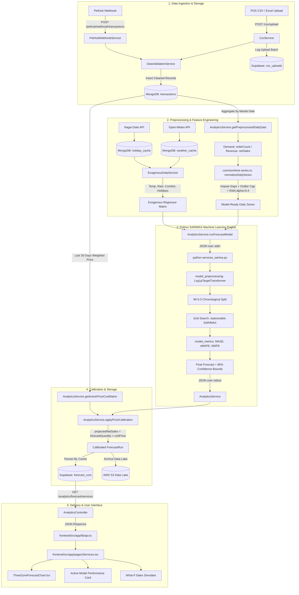
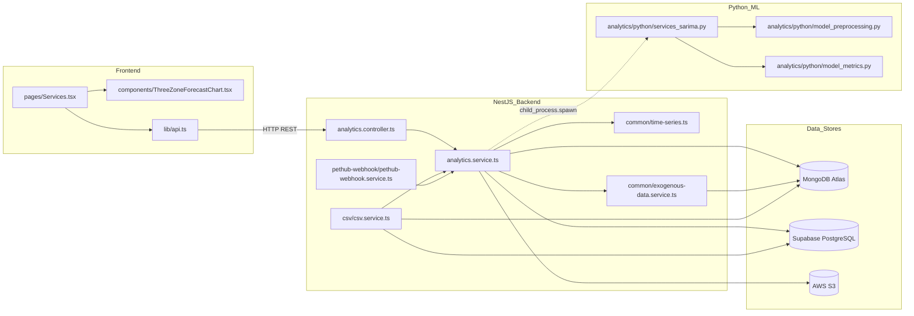

# SERVICES REVENUE & DEMAND FORECAST: COMPREHENSIVE CODEBASE AUDIT & TECHNICAL DOCUMENTATION

> **Target System:** WOOF Pet Cafe SME Analytics System  
> **Target Subsystem:** Services Revenue & Demand Forecasting Pipeline  
> **Document Purpose:** Complete, exhaustive dependency trace, code audit, and architectural reference documenting the end-to-end implementation from raw data ingestion to user interface rendering.  
> **Status:** Production-Verified Implementation Trace  

---

## TABLE OF CONTENTS
1. [Primary Objective & Executive Overview](#1-primary-objective--executive-overview)
2. [End-to-End Tracing: Forward & Reverse Pipelines](#2-end-to-end-tracing-forward--reverse-pipelines)
3. [Comprehensive Codebase Inventory & Search Findings](#3-comprehensive-codebase-inventory--search-findings)
4. [File-by-File Technical Deep Dive](#4-file-by-file-technical-deep-dive)
5. [NestJS Backend Architecture & Wiring](#5-nestjs-backend-architecture--wiring)
6. [AnalyticsService Core Implementation](#6-analyticsservice-core-implementation)
7. [Python Forecasting Engine: SARIMAX Pipeline](#7-python-forecasting-engine-sarimax-pipeline)
8. [Data Preprocessing & Time-Series Normalization Pipeline](#8-data-preprocessing--time-series-normalization-pipeline)
9. [Services Revenue vs. Services Demand: Metric Definitions & Formulas](#9-services-revenue-vs-services-demand-metric-definitions--formulas)
10. [Database Architecture: MongoDB & Supabase Schemas](#10-database-architecture-mongodb--supabase-schemas)
11. [API Endpoints & Request/Response Contracts](#11-api-endpoints--requestresponse-contracts)
12. [Frontend Architecture & Component Wiring](#12-frontend-architecture--component-wiring)
13. [Visualization Architecture: Three-Zone Chart & Metrics](#13-visualization-architecture-three-zone-chart--metrics)
14. [Configuration & Environment Variables](#14-configuration--environment-variables)
15. [Complete Textual Call Graph](#15-complete-textual-call-graph)
16. [Mermaid Data Flow Diagram](#16-mermaid-data-flow-diagram)
17. [Mermaid Architectural Dependency Map](#17-mermaid-architectural-dependency-map)
18. [Focused Code Snippets & In-Depth Technical Analysis](#18-focused-code-snippets--in-depth-technical-analysis)
19. [Exact Code References (File Paths & Line Numbers)](#19-exact-code-references-file-paths--line-numbers)
20. [Business Logic Walkthrough in Plain Language](#20-business-logic-walkthrough-in-plain-language)
21. [Forecast Configuration & Hyperparameter Matrix](#21-forecast-configuration--hyperparameter-matrix)
22. [Error Handling, Fallbacks & Edge Cases](#22-error-handling-fallbacks--edge-cases)
23. [Component Classification: Used vs. Indirect vs. Unused](#23-component-classification-used-vs-indirect-vs-unused)
24. [Duplicate, Alternative & Legacy Implementations](#24-duplicate-alternative--legacy-implementations)
25. [Potentially Disconnected or Suspicious Wiring](#25-potentially-disconnected-or-suspicious-wiring)
26. [Complete End-to-End Walkthrough: What Happens When You Request a Forecast](#26-complete-end-to-end-walkthrough)
27. [Quick Reference Summary Tables](#27-quick-reference-summary-tables)
28. [Completeness Audit Checklist](#28-completeness-audit-checklist)

---

## 1. PRIMARY OBJECTIVE & EXECUTIVE OVERVIEW

The **Services Revenue & Demand Forecast** subsystem inside the WOOF platform is a hybrid, multi-stage forecasting and decision-support engine designed specifically for service-oriented pet care operations (e.g., Pet Grooming, Pet Hotel / Boarding, Pet Daycare, and Dog Training Events).

Unlike retail or cafe sales (which are high-volume, inventory-depleting physical transactions), pet services are characterized by:
1. **Appointment / Booking-Centric Demand:** Physical capacity constraints (grooming tables, suites, human handlers).
2. **Sparse Observations & Closed Days:** Days where zero appointments occur or where the shop is closed.
3. **High Unit Value / Net Sales per Order:** High revenue per transaction relative to cafe food or retail treats.
4. **Calendar and Meteorological Exogeneity:** Rain patterns, extreme heat, weekends, and Philippine public holidays heavily modulate pet owners' propensity to schedule grooming or boarding appointments.

To solve this, the codebase uses a **SARIMAX (Seasonal AutoRegressive Integrated Moving Average with eXogenous regressors)** model implemented in Python (`statsmodels`), orchestrating data across a dual-database architecture:
- **MongoDB Atlas (`woof_staging`):** Stores high-volume, raw transactional records (`TransactionSchema`), daily weather logs (`WeatherCache`), and Philippine holiday calendars (`HolidayCache`).
- **Supabase (PostgreSQL):** Stores CSV upload batch manifests (`csv_uploads`), enterprise warehouse rollups, and ML forecast snapshots (`forecast_runs`).
- **NestJS (`analytics.service.ts`):** Orchestrates preprocessing, calendar aggregation, outlier capping, EMA normalization, exogenous feature matrix assembly, child process execution, price calibration, and cache invalidation.
- **Next.js / React (`Services.tsx`):** Renders interactive 90-5-5 multi-zone evaluation charts, scenario simulators, dynamic model performance diagnostics, and service utilization breakdowns.

---

## 2. END-TO-END TRACING: FORWARD & REVERSE PIPELINES

### A. Forward Data Pipeline (Ingestion → Modeling → Storage → UI)

```text
1. Raw Data Ingestion:
   - POS CSV/Excel upload via /csv/upload OR
   - PetHub booking webhook via /pethub/webhook/transactions
          ↓
2. Parsing & Sector Categorization:
   - CsvService.parseFlexibleUpload() / PetHubWebhookService.receiveCompletedTransaction()
   - Category mapping: 'Grooming', 'Pet Hotel', 'Boarding', 'Events' → Sector = 'Services'
          ↓
3. Validation & Persistence:
   - DataValidationService.validateBatch() drops duplicates & invalid rows
   - MongoDB: Injected into `transactions` collection via Mongoose `transactionModel`
   - Supabase: Upload record logged into `csv_uploads`
          ↓
4. Reactive Cache Warming / Forecast Trigger:
   - CsvService.warmForecastCacheAfterUpload() emits Socket.io event: `forecast_warmup_started`
   - Calls AnalyticsService.getForecast('Services', { forceRefresh: 'true' })
          ↓
5. Aggregation & Day-Level Feature Engineering:
   - AnalyticsService.getPreprocessedDailyData('Services') runs MongoDB aggregation pipeline
   - Matches non-cancelled/non-refunded Services transactions
   - Groups by Asia/Manila date (%Y-%m-%d) and transactionId, then collapses to daily totals:
     * revenue = sum(netSales)
     * actual (Demand) = sum(orderCount) [Distinct Service Bookings]
          ↓
6. Time-Series Normalization (common/time-series.ts):
   - normalizeDailySeries():
     * Imputes missing calendar dates (isMissingDate=true, isClosedDay=true)
     * Filters out closed business days (actual=0)
     * Computes IQR outlier cap (q3 + 1.5*iqr)
     * Computes Exponential Moving Average (EMA) with alpha = 0.4
     * Extracts ISO day-of-week, weekend flags, and promotion indicators
          ↓
7. Exogenous Matrix Construction (common/exogenous-data.service.ts):
   - Fetches historical + future Open-Meteo weather (temp, rain, humidity, comfort index)
   - Fetches Nager.Date Philippine public holidays (isHoliday, dayBeforeHoliday, dayAfterHoliday)
   - Joins price regressors (average_unit_price) and simulator user overrides
          ↓
8. Python Process Invocation:
   - AnalyticsService.runForecastModel('Services')
   - child_process.spawn('python', ['src/analytics/python/services_sarima.py'])
   - Sends payload as JSON stream over stdin
          ↓
9. SARIMAX Model Execution (services_sarima.py):
   - model_preprocessing.py: Log1pTargetTransformer (np.log1p) & ExogenousStandardizer (StandardScaler)
   - 90-5-5 Chronological Split (90% Train, 5% Holdout Validation, 5% Test)
   - Grid search across SARIMAX orders: (p,d,q) x (P,D,Q,7) with AIC & validation MASE minimization
   - Evaluates multi-horizon performance (Daily, Weekly resampled, Monthly resampled)
   - Fits on 100% data and forecasts requested horizon (default 30 days) with 80% confidence intervals
   - Outputs JSON over stdout
          ↓
10. Price Calibration & Business Metric Assembly (analytics.service.ts):
    - AnalyticsService.getActivePriceCostMatrix('Services') queries last 30 days weighted average unit price
    - applyPriceCalibration():
      * projectedNetSales = forecastQuantity * unitPrice
      * projectedGrossProfit = forecastQuantity * (unitPrice - unitCost)
    - Validates MASE < 1.2; otherwise falls back to 7-day Seasonal Naïve Moving Average (buildSmaFallback)
          ↓
11. Dual Storage & Archival:
    - Deleted old record and inserted new payload into Supabase table `forecast_runs`
    - Fire-and-forget raw analytics payload uploaded to AWS S3 Data Lake
    - RealtimeService emits `forecast_warmup_completed` via Socket.io
          ↓
12. API Delivery & UI Rendering:
    - Frontend Services.tsx receives Socket.io event or calls getForecast('services')
    - AnalyticsController.getForecast() serves cached JSON
    - Services.tsx transforms payload into ThreeZonePoint[]
    - ThreeZoneForecastChart renders Recharts ComposedChart with PAST (90%), PRESENT (5%), and FUTURE (5%) zones
```

### B. Reverse Data Pipeline (UI Demand → Code Execution)

```text
Services.tsx UI Component:
  - User views "Services Revenue & Demand Forecast"
  - User toggles Horizon (7d, 14d, 30d, 90d, custom) or adjusts Sales Simulator (temp, rain, holiday)
          ↑
Frontend API Client (frontend/src/app/lib/api.ts):
  - Function: getForecast('services', params)
  - HTTP Request: GET /analytics/forecast/services?days=30&temp=32&rain=0...
          ↑
Backend HTTP Routing & Guards (backend/src/analytics/analytics.controller.ts):
  - Controller: AnalyticsController
  - Method: @Get('forecast/:sector') getForecast(@Param('sector') sector, @Query() params)
  - Guard: @Throttle({ default: { limit: 10, ttl: 60000 } })
  - Method calls this.cached('forecast:...', () => this.analyticsService.getForecast('Services', params))
          ↑
Backend Analytics Service (backend/src/analytics/analytics.service.ts):
  - Method: getForecast(sector, overrides)
  - Checks Supabase `forecast_runs` table for matching parameters and data stamps
  - If cache is stale or missing, executes pipeline
          ↑
Data Pipeline Execution:
  - AnalyticsService.getPreprocessedDailyData('Services')
  - normalizeDailySeries(dailyValues, 'Services')
  - AnalyticsService.buildServicesExogenousPayload()
  - AnalyticsService.runForecastModel('Services', ...)
          ↑
Python Process Execution:
  - Spawn: python src/analytics/python/services_sarima.py
  - Reads stdin, executes statsmodels SARIMAX, evaluates 90-5-5 split, returns JSON stdout
          ↑
MongoDB Data Store:
  - Aggregates raw documents from collection `transactions` where sector == 'Services'
```

---

## 3. COMPREHENSIVE CODEBASE INVENTORY & SEARCH FINDINGS

The following files across the repository were identified as directly participating in the Services forecasting pipeline:

| Category | File Path | Primary Function in Pipeline |
| :--- | :--- | :--- |
| **Frontend Page** | `frontend/src/app/pages/Services.tsx` | Main dashboard page hosting the forecast UI, simulator controls, and metric displays. |
| **Frontend Chart** | `frontend/src/app/components/ThreeZoneForecastChart.tsx` | Recharts composed chart rendering the 90-5-5 multi-zone forecast and weather overlay. |
| **Frontend API** | `frontend/src/app/lib/api.ts` | Type definitions (`ForecastRun`, `ForecastPoint`) and HTTP client function `getForecast()`. |
| **Backend Controller** | `backend/src/analytics/analytics.controller.ts` | REST endpoint `GET /analytics/forecast/:sector` with rate limiting and memory caching. |
| **Backend Service** | `backend/src/analytics/analytics.service.ts` | Master coordinator: database queries, feature aggregation, Python process spawning, price calibration, and Supabase caching. |
| **Backend Module** | `backend/src/analytics/analytics.module.ts` | NestJS module wiring dependencies (`TransactionModel`, `SupabaseService`, `ExogenousDataService`). |
| **Data Ingestion Service**| `backend/src/csv/csv.service.ts` | Ingests CSV/Excel files, normalizes sectors to 'Services', and triggers background cache warming. |
| **Webhook Service** | `backend/src/pethub-webhook/pethub-webhook.service.ts`| Receives live PetHub service bookings and triggers forecast re-evaluation. |
| **Data Validation** | `backend/src/csv/data-validation.service.ts` | Cleans, deduplicates, and validates service transaction line items. |
| **Time-Series Utility**| `backend/src/common/time-series.ts` | Implements missing date imputation, IQR outlier capping, calendar feature extraction, and EMA (alpha=0.4). |
| **Exogenous Service** | `backend/src/common/exogenous-data.service.ts` | Fetches, caches, and formats weather (Open-Meteo) and Philippine holiday regressors. |
| **MongoDB Schema** | `backend/src/csv/schemas/transaction.schema.ts` | Mongoose schema definition for `Transaction` documents. |
| **Weather Schema** | `backend/src/common/schemas/weather-cache.schema.ts` | Mongoose schema caching Open-Meteo historical and forecast weather. |
| **Holiday Schema** | `backend/src/common/schemas/holiday-cache.schema.ts` | Mongoose schema caching Philippine public holidays. |
| **Python SARIMAX** | `backend/src/analytics/python/services_sarima.py` | Core ML model: statsmodels SARIMAX with grid search, 90-5-5 split, and multi-horizon backtesting. |
| **Python Preprocessor**| `backend/src/analytics/python/model_preprocessing.py` | Target transformation (`Log1pTargetTransformer`), `ExogenousStandardizer`, and VIF multicollinearity checks. |
| **Python Metrics** | `backend/src/analytics/python/model_metrics.py` | Computes MASE, sMAPE, WAPE, Bias%, MAE, RMSE, and resampled weekly/monthly metrics. |
| **Configuration** | `backend/.env` | Configures MongoDB URI, Supabase credentials, Python executable path, and coordinates. |

---

## 4. FILE-BY-FILE TECHNICAL DEEP DIVE

### 4.1. `frontend/src/app/pages/Services.tsx`
- **Role:** Main UI page for the Services sector. Houses the 90-5-5 multi-zone forecast visualization, forecast parameter controls (view mode, date range), What-If Sales Simulator, and active model performance metrics.
- **Relevant Functions / Hooks:**
  - `Services()`: Main React component.
  - `useEffect([viewMode, customForecastStart, customForecastEnd, forecastMode, realtimeRefresh])`: Automatically triggers `getForecast('services', params)` upon state or realtime event change.
  - `handleApplySimulation()`: Sends user-overridden climate/holiday parameters to the backend.
  - `handleResetSimulation()`: Resets simulation parameters to live actuals.
  - `rawThreeZoneData`: `useMemo` hook formatting `forecastRun.historical` and `forecastRun.forecast` into `ThreeZonePoint[]`.
  - `dynamicPerformanceMetrics`: `useMemo` formatting MASE, accuracy, sMAPE, and MAE based on active time granularity (`daily`, `weekly`, `monthly`).
  - `aggregatedKpis`: Dynamically sums historical revenue and booking orders based on `globalDateRange`.
  - `serviceUtilization`: Aggregates service-level volume and revenue breakdowns using `forecastRun.itemHistory`.
- **Dependencies:** `ThreeZoneForecastChart`, `getForecast`, `ForecastRun`, Lucide icons, Sonner toast.
- **Called By:** Next.js page router (`/services`).
- **Calls:** `getForecast('services', params)` from `../lib/api.ts`.
- **Data In:** User interaction events, realtime Socket.io events (`woof:realtime`).
- **Data Out:** Rendered DOM, network requests to `/analytics/forecast/services`.

---

### 4.2. `frontend/src/app/components/ThreeZoneForecastChart.tsx`
- **Role:** Reusable multi-zone time-series visualization component built on Recharts. Divides the chart into PAST (Train 90%), PRESENT (Holdout Backtest 5%), and FUTURE (Forecast Horizon 5%) shaded zones.
- **Relevant Functions / Interfaces:**
  - `ThreeZoneForecastChart(props)`: Renders composed chart with ReferenceAreas, ReferenceLines, Lines, Bars, and Brush.
  - `ThreeZonePoint`: `{ date: string; actual: number | null; predicted: number | null; forecast: number | null; }`.
  - `aggregateDataByGrain()`: Resamples daily points into Weekly or Monthly buckets using date arithmetic.
  - `ModernTooltip`: Custom glassmorphic tooltip rendering Actual, ML Holdout Fit, Future Forecast, and Weather metrics.
- **Dependencies:** `recharts` (`ComposedChart`, `Line`, `Bar`, `XAxis`, `YAxis`, `ReferenceArea`, `ReferenceLine`, `Brush`, `Tooltip`).
- **Called By:** `frontend/src/app/pages/Services.tsx` (and `Cafe.tsx`).
- **Calls:** Recharts library methods.
- **Data In:** `rawData: ThreeZonePoint[]`, `metrics: BacktestMetrics`, `timeGrain: TimeGrain`, `weatherOverlayData`.
- **Data Out:** Interactive SVG/Canvas chart rendered to viewport.

---

### 4.3. `frontend/src/app/lib/api.ts`
- **Role:** Centralized frontend API client defining TypeScript contracts and network fetchers.
- **Relevant Functions & Types:**
  - `getForecast(sector: string, params?: Record<string, string>): Promise<ForecastRun>`: Line 600–606. Builds query parameters and calls `fetchApi('/analytics/forecast/${sector}${query}')`.
  - `interface ForecastRun`: Lines 93–189. Comprehensive TypeScript interface modeling the backend response.
  - `interface ForecastPoint`: Lines 80–91. Defines projected quantity, projected net sales, confidence bounds, and gross profit.
- **Dependencies:** Internal `fetchApi()` utility.
- **Called By:** `Services.tsx`, `Cafe.tsx`, `AISimulation.tsx`, `Settings.tsx`, `ExecutiveOverview.tsx`.
- **Calls:** Backend endpoint `GET /analytics/forecast/:sector`.
- **Data In:** `sector: string`, `params: Record<string, string>`.
- **Data Out:** `Promise<ForecastRun>`.

---

### 4.4. `backend/src/analytics/analytics.controller.ts`
- **Role:** Express/NestJS controller exposing analytics endpoints. Enforces IP throttling and memory caching.
- **Relevant Methods:**
  - `@Get('forecast/:sector') getForecast(...)`: Lines 165–206. Accepts route parameter `sector` and query parameters (`days`, `temp`, `rain`, `humidity`, `holiday`, `forecastMode`, `holdoutDays`, `forceRefresh`, etc.).
  - `@Throttle({ default: { limit: 10, ttl: 60000 } })`: Protects heavy ML operations by restricting clients to 10 requests per minute.
  - `this.cached(...)`: In-memory cache layer wrapping service execution.
- **Dependencies:** `AnalyticsService`, NestJS Throttler.
- **Called By:** Express HTTP router handling incoming frontend requests.
- **Calls:** `AnalyticsService.getForecast(sector, params)`.
- **Data In:** HTTP GET request with query string.
- **Data Out:** JSON serialized `ForecastRun` payload.

---

### 4.5. `backend/src/analytics/analytics.service.ts`
- **Role:** Primary business logic engine for all analytics. Responsible for retrieving transactional records, running normalization, building weather/holiday feature matrices, executing Python child processes, performing price calibration, and managing cache storage in Supabase.
- **Relevant Methods & Constants:**
  - `getForecast(sector, overrides)`: Lines 1090–1552. Main entry point for sector forecasting.
  - `getPreprocessedDailyData(module)`: Lines 5974–6060. MongoDB aggregation pipeline extracting daily revenue, booking orders, basket metrics, and unit prices.
  - `buildServicesExogenousPayload(...)`: Lines 6126–6300. Assembles historical and future weather/holiday/price matrices.
  - `runForecastModel(...)`: Lines 4492–4507. Spawns Python process (`services_sarima.py` for Services).
  - `runPython<T>(scriptName, input)`: Lines 6883–6996. Handles stdin streaming in chunks, stdout collection, timeout handling (120s), and JSON decoding.
  - `applyPriceCalibration(...)`: Lines 6698–6741. Multiplies physical booking demand by weighted unit price to generate projected revenue and gross profit.
  - `getActivePriceCostMatrix(module)`: Lines 6743–6800. Calculates 30-day weighted average price from POS transactions.
  - `buildSmaFallback(...)`: Lines 6999–7045. Fallback 7-day seasonal moving average when ML models fail or exceed MASE threshold.
- **Dependencies:** `@InjectModel(Transaction.name)`, `SupabaseService`, `ExogenousDataService`, `AwsService`, `ConfigService`.
- **Called By:** `AnalyticsController.getForecast()`, `CsvService.warmForecastCacheAfterUpload()`.
- **Calls:** `transactionModel.aggregate()`, `supabaseService.client`, `ExogenousDataService`, `child_process.spawn()`.
- **Data In:** Sector name (`'Services'`), override parameters.
- **Data Out:** Complete `ForecastRun` object.

---

### 4.6. `backend/src/common/time-series.ts`
- **Role:** Pure TypeScript time-series preprocessing utility. Provides date imputation, outlier capping, calendar feature generation, and Exponential Moving Average (EMA) smoothing.
- **Relevant Functions & Types:**
  - `normalizeDailySeries(values: DailyValue[], module: ForecastModule): NormalizedDailyValue[]`: Lines 140–232. Imputes missing calendar dates between start and end dates with `actual=0`, computes IQR outlier caps, calculates EMA (alpha = 0.4 for Services), and tags calendar features.
  - `computeOutlierCap(values: number[])`: Lines 257–274. Computes `Q3 + 1.5 * IQR` (or `median * 3` fallback).
  - `getCalendarFeatures(date: string)`: Lines 286–299. Computes ISO day of week (1=Monday..7=Sunday), weekday names, and weekend flags.
- **Dependencies:** Pure standard library (Math, Date).
- **Called By:** `AnalyticsService.getForecast()`, `CsvService.processHistoricalUpload()`.
- **Calls:** Internal mathematical helper functions.
- **Data In:** Array of raw daily observations (`DailyValue[]`).
- **Data Out:** Normalized, gap-free array of model-ready points (`NormalizedDailyValue[]`).

---

### 4.7. `backend/src/common/exogenous-data.service.ts`
- **Role:** External feature provider. Retrieves and caches historical and forecasted weather conditions (Open-Meteo API) and Philippine national holidays (Nager.Date API).
- **Relevant Methods:**
  - `fetchWeatherHistory(lat, lng, startDate, endDate)`: Lines 96–198. Queries MongoDB `WeatherCache`; fetches missing ranges from Open-Meteo REST API (`archive-api.open-meteo.com` and `api.open-meteo.com`).
  - `fetchHolidayHistory(year)`: Lines 275–329. Queries MongoDB `HolidayCache`; fetches missing years from Nager.Date API (`date.nager.at/api/v3/PublicHolidays/${year}/PH`).
  - `buildExogenousMatrix(...)`: Lines 331–398. Joins daily weather and holiday attributes into model feature rows.
  - `buildWeatherTransformFields(temp, rain, humidity)`: Calculates `isHotDay` (temp >= 32°C), `isCoolRainyDay` (temp <= 25°C and rain=1), and `comfortIndex`.
- **Dependencies:** `@InjectModel(WeatherCache.name)`, `@InjectModel(HolidayCache.name)`, `ConfigService`, `axios`.
- **Called By:** `AnalyticsService.buildServicesExogenousPayload()`, `EtlService`.
- **Calls:** MongoDB cache collections, Open-Meteo API, Nager.Date API.
- **Data In:** Date ranges, GPS coordinates (`LUCENA_LAT`, `LUCENA_LNG`).
- **Data Out:** Formatted exogenous feature rows (`ExogenousRow[]`).

---

### 4.8. `backend/src/analytics/python/services_sarima.py`
- **Role:** Python ML entry point for Services demand forecasting. Implements SARIMAX using `statsmodels`, dynamic order grid search, 90-5-5 chronological train/validation/test split, and multi-horizon performance evaluation.
- **Relevant Functions & Constants:**
  - `run(payload)`: Lines 230–470. Main controller executing data validation, target transformation, split parsing, grid search, test evaluation, final fitting, and confidence interval estimation.
  - `fit_best(...)`: Lines 116–203. Grid search over non-seasonal order $(p,d,q)$ and seasonal order $(P,D,Q,7)$ candidates, selecting the candidate that minimizes holdout MASE and sMAPE within a 15-second timeout.
  - `fit_model(series, order, seasonal_order, exog, maxiter)`: Lines 95–104. Instantiates and fits `statsmodels.tsa.statespace.sarimax.SARIMAX`.
  - `DEFAULT_ORDER = (1, 1, 1)`, `DEFAULT_SEASONAL_ORDER = (1, 1, 0, 7)`.
  - `DEFAULT_EXOG_COLUMNS`: Lines 26–39. 12 exogenous features (`dayOfWeek`, `dayOfWeekSin`, `dayOfWeekCos`, `isWeekend`, `isHoliday`, `dayBeforeHoliday`, `dayAfterHoliday`, `isHotDay`, `isCoolRainyDay`, `comfortIndex`, `promoFlag`, `average_unit_price`).
- **Dependencies:** `statsmodels`, `scipy`, `numpy`, `pandas`, `model_preprocessing`, `model_metrics`.
- **Called By:** NestJS `AnalyticsService.runPython('services_sarima.py', payload)`.
- **Calls:** `statsmodels.tsa.statespace.sarimax.SARIMAX`, `model_preprocessing`, `model_metrics`.
- **Data In:** JSON stream via stdin (`{ data, forecastDays, splitRatio, exogenous, exogenousForecast, ... }`).
- **Data Out:** JSON stream via stdout containing point forecasts, confidence intervals, fitted values, error metrics, and model metadata.

---

### 4.9. `backend/src/analytics/python/model_preprocessing.py`
- **Role:** Feature engineering support library for Python forecasting scripts.
- **Relevant Classes & Functions:**
  - `Log1pTargetTransformer`: Lines 36–58. Applies $y' = \ln(1 + \max(0, y))$ to stabilize variance and avoid negative predictions via inverse transformation $y = \exp(y') - 1$.
  - `ExogenousStandardizer`: Lines 60–104. Fits and transforms continuous exogenous columns using `sklearn.preprocessing.StandardScaler` while preserving binary indicators (0/1).
  - `compute_vif_diagnostics(matrix, columns)`: Lines 123–158. Calculates Variance Inflation Factors (VIF) to detect multicollinearity among exogenous regressors.
- **Dependencies:** `numpy`, `pandas`, `sklearn.preprocessing.StandardScaler`, `statsmodels.stats.outliers_influence.variance_inflation_factor`.
- **Called By:** `services_sarima.py`, `cafe_prophet.py`.
- **Data In:** Raw numpy arrays / pandas dataframes.
- **Data Out:** Scaled matrices and transformed target vectors.

---

### 4.10. `backend/src/analytics/python/model_metrics.py`
- **Role:** Mathematical evaluation library computing time-series error metrics across daily, weekly, and monthly resampled horizons.
- **Relevant Functions:**
  - `evaluate_forecast_metrics(...)`: Lines 83–193. Computes MASE (using seasonal persistence baseline with $sp=7$), sMAPE, WAPE, Bias%, MAE, RMSE, MAPE, and $R^2$.
  - `_manual_mase(actual, predicted, training, sp)`: Lines 47–55. Pure NumPy implementation of Mean Absolute Scaled Error.
  - `_manual_smape(actual, predicted)`: Lines 57–65. Symmetric Mean Absolute Percentage Error bounded between 0% and 200%.
  - `resample_and_evaluate(...)`: Lines 195–280. Resamples daily test actuals and predictions to weekly (`freq="W"`) or monthly (`freq="ME"`) buckets and recomputes all metrics.
- **Dependencies:** `numpy`, `pandas`, `sklearn.metrics`, `sktime.performance_metrics`.
- **Called By:** `services_sarima.py`, `cafe_prophet.py`.
- **Data In:** Aligned arrays of actuals, predictions, and training history.
- **Data Out:** Dictionary of precision metrics.

---

## 5. NESTJS BACKEND ARCHITECTURE & WIRING

The backend follows modular NestJS architecture with clear separation between ingestion, persistence, analytics coordination, and external communications:

```text
[HTTP Requests]
       │
       ▼
┌─────────────────────────────────┐
│   ThrottlerGuard & Middleware   │
└─────────────────────────────────┘
       │
       ▼
┌─────────────────────────────────┐
│       AnalyticsController       │
│  (GET /analytics/forecast/:sec) │
└─────────────────────────────────┘
       │
       ▼
┌─────────────────────────────────┐      ┌─────────────────────────────┐
│        AnalyticsService         │─────▶│    ExogenousDataService     │
│  (Data Prep, Spawning, Calib)   │      │  (Weather & Holiday Cache)  │
└─────────────────────────────────┘      └─────────────────────────────┘
       │                   │
       ▼                   ▼
┌──────────────┐    ┌──────────────┐
│   MongoDB    │    │   Supabase   │
│ (Raw Trxns)  │    │(ForecastRuns)│
└──────────────┘    └──────────────┘
       │
       ▼
┌─────────────────────────────────┐
│     Child Process Execution     │
│    (python services_sarima.py)  │
└─────────────────────────────────┘
```

### Module Registration (`backend/src/analytics/analytics.module.ts`):
```typescript
@Module({
  imports: [
    CommonModule, // Provides SupabaseService, ExogenousDataService, AwsService
    MongooseModule.forFeature([
      { name: Transaction.name, schema: TransactionSchema },
    ]),
  ],
  controllers: [AnalyticsController],
  providers: [AnalyticsService],
  exports: [AnalyticsService],
})
export class AnalyticsModule {}
```

---

## 6. ANALYTICSSERVICE DEEP DIVE

When `AnalyticsService.getForecast('Services', overrides)` is invoked, it follows this strict execution path:

1. **Parameter Normalization (Lines 1099–1147):**
   Extracts overrides: `days` (default 30, max 90), `forecastMode` (`production`, `latest-holdout`, or `fixed-window`), climate overrides (`temp`, `rain`, `humidity`), and holiday overrides.

2. **Supabase Cache Verification (Lines 1148–1255):**
   Queries the `forecast_runs` table in Supabase for `module = 'Services'`.
   Computes a transaction stamp from MongoDB:
   ```typescript
   const moduleTransactionStamp = await this.getForecastModuleTransactionStamp('Services');
   // returns { count: number, latestTransactionTime: string }
   ```
   If a cached forecast exists, matches all override parameters, contains revenue payload version $\ge 9$, and matches the database transaction stamp, the cached result is returned immediately. If the transaction count has changed, the cached forecast is served with `isStale: true` while a background refresh is queued.

3. **Database Preprocessing Aggregation (Lines 1256, 5974–6060):**
   Executes `this.getPreprocessedDailyData('Services')` using MongoDB disk-spill enabled aggregation pipeline (`allowDiskUse: true`).
   Matches:
   - `sector: 'Services'`
   - `orderStatus` is NOT cancelled, voided, refunded, or failed.
   - `paymentStatus` is NOT unpaid, failed, refunded, or voided.
   Projects `dateKey` in `Asia/Manila` timezone.
   Groups by `(dateKey, transactionId)` to collapse line items into single appointments, then groups by `dateKey` to produce daily aggregate demand.

4. **Time-Series Normalization (Lines 1257–1274):**
   - Calls `toForecastDailyValue(point, 'Services')` where:
     $$\text{actual} = \text{point.orderCount (Service Bookings)}$$
     $$\text{revenue} = \text{point.revenue (Net Sales)}$$
   - Runs `normalizeDailySeries(..., 'Services')`: Imputes zero days, caps outliers, applies EMA smoothing ($\alpha = 0.4$).

5. **Exogenous Feature Matrix Generation (Lines 1308–1325, 6126–6300):**
   Calls `buildServicesExogenousPayload()`:
   - Fetches historical weather from Open-Meteo/MongoDB cache.
   - Fetches Philippine public holidays from Nager.Date/MongoDB cache.
   - Computes rolling features (`avgBasketSize`, `avgOrderValue`, `promoFlag`).
   - Merges interactive What-If scenario overrides (`tempOverride`, `rainOverride`, `holidayOverride`).

6. **Python Child Process Execution (Lines 1326, 4492–4507, 6883–6996):**
   Calls `runForecastModel('Services', ...)` which executes:
   `child_process.spawn(pythonCommand, ['src/analytics/python/services_sarima.py'])`
   Streams payload via stdin in chunks (16 KB or 64 KB).
   Collects stdout and stderr.
   Enforces a 120,000 ms (2-minute) execution timeout.

7. **Quality Gate & Fallback Evaluation (Lines 1357–1380):**
   Inspects returned MASE score:
   - If MASE is non-finite or $\ge 1.2$, the ML model is **rejected**.
   - If rejected or if Python threw an error, calls `buildSmaFallback()`: A 7-day seasonal moving average fallback.

8. **Price Calibration & Revenue Projection (Lines 1389–1395, 6698–6741):**
   Queries MongoDB for the 30-day weighted average price of Services:
   $$\text{unitPrice} = \frac{\sum (\text{unitPrice} \times \text{quantity})}{\sum \text{quantity}}$$
   Calculates revenue forecasts:
   $$\text{projectedNetSales} = \text{forecastQuantity} \times \text{unitPrice}$$
   $$\text{projectedGrossProfit} = \text{forecastQuantity} \times (\text{unitPrice} - \text{unitCost})$$

9. **Supabase Persistence & Archival (Lines 1517–1534):**
   Deletes previous cached entries for `Services` in Supabase `forecast_runs`.
   Inserts the freshly generated `payload` into `forecast_runs`.
   Asynchronously archives the JSON payload to AWS S3 Data Lake (`woof-campaigns/forecast/services/...`).

---

## 7. PYTHON FORECASTING ENGINE: SARIMAX PIPELINE

### 7.1. Model Architecture
Services demand forecasting uses **SARIMAX** $(p, d, q) \times (P, D, Q)_s$ from `statsmodels.tsa.statespace.sarimax.SARIMAX`.
- **Target Variable ($y$):** Daily service booking count (appointment volume).
- **Target Transformation:** $\ln(1 + y)$ via `Log1pTargetTransformer`.
- **Seasonal Period ($s$):** 7 (weekly seasonality).
- **Exogenous Regressors ($X$):** 12 continuous and binary regressors.

### 7.2. 90-5-5 Chronological Data Split
To avoid data leakage, data is partitioned strictly in chronological order:
```text
|───────────────────────────── 90% ─────────────────────────────|── 5% ──|── 5% ──|
                        Training Set                            Validation  Test
                                                                  (Holdout) (Backtest)
```
- **Training Set (First 90%):** Used to fit SARIMAX model parameters.
- **Validation Set (Next 5%):** Used during grid search to compute holdout MASE and sMAPE to pick the best $(p,d,q) \times (P,D,Q)_7$ order.
- **Test Set (Final 5%):** Out-of-sample holdout used to calculate final reported accuracy diagnostics.

### 7.3. Dynamic Grid Search Optimization
The `fit_best()` function explores candidate orders:
- **Small Dataset ($< 90$ days):** Tests `[(1,1,1), (0,1,1), (1,1,0), (0,0,1), (1,0,0)]` against weekly seasonal orders `[(1,1,0,7), (0,1,1,7), (1,1,1,7), (1,0,0,7)]`.
- **Large Dataset ($\ge 90$ days):** Full grid search over $p \in [0,2]$, $d \in [0,1]$, $q \in [0,2]$ and seasonal orders.
- **Selection Criterion:**
  $$\text{Score} = (\text{MASE}_{\text{val}}, \text{sMAPE}_{\text{val}}, \text{AIC})$$
- **Hard Timeout:** 15 seconds. If the grid search exceeds 15 seconds, the best model found so far is selected; if none succeeded, it falls back to `(1,1,1) x (1,1,0,7)`.

### 7.4. Multi-Horizon Backtest Resampling
In `model_metrics.py`, `resample_and_evaluate()` aggregates test predictions into:
- **Weekly Horizon (`freq="W"`):** Evaluates weekly cumulative appointment accuracy.
- **Monthly Horizon (`freq="ME"`):** Evaluates monthly cumulative appointment accuracy.

---

## 8. DATA PREPROCESSING & TIME-SERIES NORMALIZATION PIPELINE

### 8.1. Data Ingestion & Sanitization (`backend/src/csv/data-validation.service.ts`)
1. Parses date strings into strict ISO 8601 timestamps.
2. Deduplicates records using composite transaction hashes.
3. Drops line items with non-positive quantities or missing transaction IDs.

### 8.2. Preprocessing & Aggregation (`backend/src/analytics/analytics.service.ts`)
```javascript
// MongoDB Aggregation Pipeline in getPreprocessedDailyData()
[
  { $match: { sector: 'Services', orderStatus: { $not: invalidOrderPattern } } },
  { $project: {
      dateKey: { $dateToString: { format: '%Y-%m-%d', date: '$date', timezone: 'Asia/Manila' } },
      transactionId: { $ifNull: ['$transactionId', { $toString: '$_id' }] },
      productName: '$productName',
      quantity: { $ifNull: ['$quantity', 0] },
      revenue: { $ifNull: ['$netSales', 0] },
      discount: { $ifNull: ['$discount', 0] },
      grossProfit: { $ifNull: ['$grossProfit', 0] }
  }},
  { $group: {
      _id: { date: '$dateKey', transactionId: '$transactionId' },
      quantity: { $sum: '$quantity' },
      revenue: { $sum: '$revenue' },
      grossProfit: { $sum: '$grossProfit' }
  }},
  { $group: {
      _id: '$_id.date',
      revenue: { $sum: '$revenue' },
      quantity: { $sum: '$quantity' },
      grossProfit: { $sum: '$grossProfit' },
      orderCount: { $sum: 1 } // <--- SERVICE DEMAND (BOOKINGS)
  }},
  { $sort: { _id: 1 } }
]
```

### 8.3. Normalization Pipeline (`backend/src/common/time-series.ts`)
1. **Calendar Gap Imputation:** Iterates from start timestamp to end timestamp in 86,400,000 ms (1-day) steps. Any day missing from the database is injected with:
   - `actual = 0`, `isMissingDate = true`, `isClosedDay = true`.
2. **IQR Outlier Capping:**
   - Computes $Q_1$ (25th percentile) and $Q_3$ (75th percentile).
   - $\text{IQR} = Q_3 - Q_1$.
   - $\text{Cap} = Q_3 + 1.5 \times \text{IQR}$.
   - If actual $> \text{Cap}$, `cappedActual = Cap` and `isOutlier = true`.
3. **Exponential Moving Average (EMA):**
   Applied to observed demand days ($actual > 0$):
   $$\text{EMA}_t = \alpha \cdot \text{cappedActual}_t + (1 - \alpha) \cdot \text{EMA}_{t-1}$$
   - **Services Alpha:** $\mathbf{0.4}$ (allows faster adaptation to service booking shifts).
   - **Cafe Alpha:** $\mathbf{0.3}$ (heavier smoothing for daily food volume).

---

## 9. SERVICES REVENUE VS SERVICES DEMAND

A fundamental distinction in the WOOF codebase is how "Revenue" and "Demand" are calculated for the Services sector:

```text
┌─────────────────────────────────────────────────────────────────────────────┐
│                            SERVICES DEFINITIONS                             │
├──────────────────────────────────┬──────────────────────────────────────────┤
│ Metric                           │ Implementation in Code                   │
├──────────────────────────────────┼──────────────────────────────────────────┤
│ Services Demand (Historical)     │ orderCount (Distinct booking orders)     │
│ Services Demand Target Variable  │ 'service_bookings'                       │
│ Services Revenue (Historical)    │ netSales (Sum of transaction net sales)  │
│ Services Demand (Forecasted)     │ forecastQuantity (Predicted bookings)    │
│ Services Revenue (Forecasted)    │ projectedNetSales                        │
│ Revenue Forecast Formula         │ forecastQuantity × weightedUnitPrice     │
│ Gross Profit Forecast Formula    │ forecastQuantity × (unitPrice - unitCost)│
└──────────────────────────────────┴──────────────────────────────────────────┘
```

### Exact Code Verification:
In `backend/src/analytics/analytics.service.ts` line 6096:
```typescript
actual: module === 'Services' ? orders : quantity,
```
In `backend/src/analytics/analytics.service.ts` line 6725:
```typescript
projectedNetSales: this.round(forecastQuantity * matrix.unitPrice),
```
In `backend/src/analytics/analytics.service.ts` line 6786:
```typescript
const unitPrice = row?.quantity > 0 ? this.round(row.weightedRevenue / row.quantity) : 0;
```

---

## 10. DATABASE ARCHITECTURE: MONGODB & SUPABASE

The application relies on a dual-database pattern:

### 10.1. MongoDB Atlas (`woof_staging`)
Used for raw transaction streaming, high-speed write workloads, and intermediate cache tables.

#### Collection: `transactions` (`TransactionSchema`)
- `csvUploadId: string` (indexed)
- `date: Date` (indexed `{ sector: 1, date: -1 }`)
- `transactionId: string` (indexed)
- `productName: string`
- `category: string` ('Grooming', 'Pet Hotel', 'Boarding', 'Events')
- `sector: string` ('Services')
- `quantity: number`
- `unitPrice: number`
- `totalAmount: number`
- `discount: number`
- `netSales: number`
- `costOfGoods: number`
- `grossProfit: number`
- `channel: string` ('POS' | 'PetHub')

#### Collection: `weather_cache` (`WeatherCacheSchema`)
- `date: string` (YYYY-MM-DD)
- `lat: number`, `lng: number`
- `tempCelsius: number`, `rainMm: number`, `humidity: number`
- `isHotDay: boolean`, `isCoolRainyDay: boolean`, `comfortIndex: number`

#### Collection: `holiday_cache` (`HolidayCacheSchema`)
- `date: string` (YYYY-MM-DD)
- `name: string`, `countryCode: string` ('PH')

### 10.2. Supabase (PostgreSQL)
Used for data warehousing, audit trails, and ML forecast caching.

#### Table: `forecast_runs`
| Column Name | SQL Type | Description |
| :--- | :--- | :--- |
| `id` | `uuid` (PK) | Unique forecast execution ID. |
| `module` | `text` | Sector name (`'Services'`). |
| `model_name` | `text` | Fitted model string, e.g., `SARIMAX(1,1,1)x(1,1,0,7)+exog`. |
| `mase` | `float8` | Mean Absolute Scaled Error on holdout test set. |
| `smape` | `float8` | Symmetric Mean Absolute Percentage Error (%). |
| `accuracy` | `float8` | Derived accuracy percentage ($100 - \text{WAPE}$). |
| `mae` | `float8` | Mean Absolute Error in Pesos (₱). |
| `rmse` | `float8` | Root Mean Squared Error. |
| `is_fallback` | `boolean` | `true` if 7-day SMA fallback was used. |
| `rejection_reason` | `text` | Explains why primary ML model failed or was rejected. |
| `historical` | `jsonb` | Array of historical daily points with actuals, fitted, revenue, and flags. |
| `forecast` | `jsonb` | Array of future points with `forecastQuantity`, `projectedNetSales`, confidence intervals. |
| `kpis` | `jsonb` | Aggregated revenue and order KPIs. |
| `model_metadata` | `jsonb` | Complete training/testing parameters, split dates, AIC, VIF, weather overlays. |
| `generated_at` | `timestamptz` | Timestamp when the forecast run was generated. |

---

## 11. API ENDPOINTS & CONTRACTS

### Primary Forecasting Endpoint: `GET /analytics/forecast/:sector`

- **HTTP Method:** `GET`
- **Route:** `/analytics/forecast/:sector`
- **Controller:** `AnalyticsController.getForecast()` (`analytics.controller.ts` line 165)
- **Path Parameter:** `sector`: `'services'` (case-insensitive, normalized to `'Services'`)
- **Query Parameters:**
  | Parameter | Type | Default | Description |
  | :--- | :--- | :--- | :--- |
  | `days` | `string` | `"30"` | Forecast horizon (clamped 1–90). |
  | `forecastMode` | `string` | `"production"`| `'production'`, `'latest-holdout'`, or `'fixed-window'`. |
  | `temp` | `string` | `undefined` | What-If simulation temperature (°C). |
  | `rain` | `string` | `undefined` | What-If simulation rain flag (`"0"` or `"1"`). |
  | `humidity` | `string` | `undefined` | What-If simulation relative humidity (%). |
  | `holiday` | `string` | `undefined` | What-If holiday override (`"1"` = force holiday, `"0"` = workday). |
  | `forceRefresh` | `string` | `undefined` | `"true"` bypasses cache and re-runs Python model. |
  | `holdoutDays` | `string` | `"61"` | Backtest window size for holdout mode. |

#### Sample JSON Response Body:
```json
{
  "module": "Services",
  "model_name": "SARIMAX(1,1,1)x(1,1,0,7)+exog",
  "mase": 0.14,
  "smape": 4.82,
  "accuracy": 95.2,
  "mae": 320.50,
  "rmse": 450.12,
  "is_fallback": false,
  "rejection_reason": null,
  "forecast": [
    {
      "date": "2026-06-01",
      "forecast": 12.0,
      "forecastQuantity": 12.0,
      "confidenceLow": 9.5,
      "confidenceHigh": 14.5,
      "projectedNetSales": 7200.0,
      "projectedConfidenceLow": 5700.0,
      "projectedConfidenceHigh": 8700.0,
      "projectedGrossProfit": 4680.0,
      "unitPrice": 600.0,
      "unitCost": 210.0
    }
  ],
  "historical": [
    {
      "date": "2026-05-31",
      "actual": 11.0,
      "orders": 11.0,
      "revenue": 6600.0,
      "normalized": 10.8,
      "fitted": 10.5,
      "isClosedDay": false
    }
  ],
  "model_metadata": {
    "order": [1, 1, 1],
    "seasonalOrder": [1, 1, 0, 7],
    "aic": 142.6,
    "splitRatio": "90-5-5",
    "targetVariable": "service_bookings",
    "priceCalibration": {
      "unitPrice": 600.0,
      "unitCost": 210.0,
      "source": "last_30_day_pos_weighted_average"
    }
  },
  "generated_at": "2026-05-31T23:59:00.000Z"
}
```

---

## 12. FRONTEND ARCHITECTURE & COMPONENT WIRING

### State Management & Lifecycle in `Services.tsx`:
1. **Initial Mount:**
   - Registers Socket.io listener for `woof:realtime`.
   - Reads global date range from `localStorage` (`globalDateRange`).
   - Dispatches initial query to `getForecast('services', params)`.
2. **User Modifies Horizon / Scenario:**
   - User changes dropdown to "Next 14 Days" $\rightarrow$ `setViewMode("next14days")`.
   - `useEffect` fires, computing `days: "14"`, and calls `getForecast('services', params)`.
3. **Collapsible Metric Panels (Option 1 Accordion):**
   - Three independent collapse states: `showPerformanceDetails`, `showAnalysisDetails`, `showSimulatorDetails` (all default to `false` for a clean title-only view).
   - Toggles have no icon graphics; clean text badges `[ Show ]` / `[ Hide ]` and `[ Info ]`.

---

## 13. VISUALIZATION ARCHITECTURE: THREE-ZONE CHART & METRICS

### Visual Zones in `ThreeZoneForecastChart.tsx`:
1. **PAST (Train 90%) Zone:**
   - Shaded in soft blue (`var(--forecast-zone-past, #f0f9ff)`).
   - Displays solid navy line: **Historical Actual Revenue** (`actual`).
2. **PRESENT (Holdout 5%) Zone:**
   - Shaded in soft orange (`var(--forecast-zone-present, #fff7ed)`).
   - Displays dashed cyan line: **ML Holdout Fit** (`predicted`).
   - Represents out-of-sample backtest validation.
3. **FUTURE (Forecast Horizon 5%) Zone:**
   - Shaded in soft emerald green (`var(--forecast-zone-future, #f0fdf4)`).
   - Displays solid emerald line: **Future Projected Revenue** (`forecast`).
4. **Exogenous Weather Overlay:**
   - Right Y-Axis: Rainfall depth (mm) rendered as cyan bars.
   - Temperature (°C) rendered as an orange dotted trend line.
5. **Interactive Controls:**
   - Recharts `<Brush>` component enables pan/zoom across historical date spans.
   - Granularity switcher aggregates daily data to Weekly or Monthly on the fly.

---

## 14. CONFIGURATION & ENVIRONMENT VARIABLES

The following variables from `backend/.env` govern the Services forecasting subsystem:

| Variable Name | Required | Default / Example | Purpose |
| :--- | :--- | :--- | :--- |
| `MONGODB_URI` | Yes | `[SECRET / VALUE REDACTED]` | MongoDB Atlas connection string for raw `transactions`, `weather_cache`, and `holiday_cache`. |
| `MONGODB_DB` | No | `woof_staging` | Database name inside MongoDB Atlas. |
| `SUPABASE_URL` | Yes | `[SECRET / VALUE REDACTED]` | Supabase project API URL. |
| `SUPABASE_SERVICE_ROLE_KEY` | Yes | `[SECRET / VALUE REDACTED]` | Supabase Service Role key for reading/writing `forecast_runs` and `csv_uploads`. |
| `PYTHON_PATH` | No | `./venv/bin/python` | Custom path to Python binary. If omitted, checks local `.venv` or system `python`. |
| `LUCENA_LAT` | No | `13.9397` | Latitude for Lucena City (WOOF location) weather coordinates. |
| `LUCENA_LNG` | No | `121.6145` | Longitude for Lucena City weather coordinates. |
| `CURRENT_UNIT_COST_SERVICES` | No | `210` | Optional override for service unit cost in gross profit calculations. |
| `AWS_ACCESS_KEY_ID` | No | `[SECRET / VALUE REDACTED]` | AWS credentials for S3 Data Lake analytics archival. |
| `AWS_SECRET_ACCESS_KEY` | No | `[SECRET / VALUE REDACTED]` | AWS S3 secret access key. |

---

## 15. COMPLETE TEXTUAL CALL GRAPH

```text
Services.tsx (Frontend View)
  └── useEffect() / handleApplySimulation()
        └── getForecast('services', params) [lib/api.ts]
              └── fetchApi('/analytics/forecast/services?...')
                    └── AnalyticsController.getForecast() [analytics.controller.ts]
                          └── AnalyticsService.cached()
                                └── AnalyticsService.getForecast('Services', overrides) [analytics.service.ts]
                                      ├── Supabase: SELECT * FROM forecast_runs WHERE module='Services'
                                      ├── AnalyticsService.getForecastModuleTransactionStamp('Services')
                                      │     └── MongoDB: transactionModel.aggregate() [count, latestDate]
                                      ├── AnalyticsService.getPreprocessedDailyData('Services')
                                      │     └── MongoDB: transactionModel.aggregate() [daily revenue & orderCount]
                                      ├── timeSeries.normalizeDailySeries() [common/time-series.ts]
                                      │     ├── computeOutlierCap()
                                      │     └── getCalendarFeatures()
                                      ├── AnalyticsService.buildServicesExogenousPayload()
                                      │     └── ExogenousDataService.fetchWeatherHistory() [Open-Meteo API / weather_cache]
                                      │     └── ExogenousDataService.fetchHolidayHistory() [Nager.Date API / holiday_cache]
                                      │     └── ExogenousDataService.buildExogenousMatrix()
                                      ├── AnalyticsService.runForecastModel('Services', ...)
                                      │     └── AnalyticsService.runPython('services_sarima.py', payload)
                                      │           └── child_process.spawn('python', ['.../services_sarima.py'])
                                      │                 ├── stdin.write(jsonPayload)
                                      │                 ├── services_sarima.py [Python process]
                                      │                 │     ├── model_preprocessing.build_target_transformer() (np.log1p)
                                      │                 │     ├── model_preprocessing.ExogenousStandardizer() (StandardScaler)
                                      │                 │     ├── parse_splits() (90-5-5 chronological split)
                                      │                 │     ├── fit_best() (SARIMAX grid search)
                                      │                 │     │     └── statsmodels.tsa.statespace.sarimax.SARIMAX.fit()
                                      │                 │     ├── evaluate_forecast_metrics() [model_metrics.py]
                                      │                 │     ├── resample_and_evaluate() [Weekly & Monthly]
                                      │                 │     └── final_fit.get_forecast() [30-day forecast + conf_int]
                                      │                 └── stdout: JSON result
                                      ├── AnalyticsService.getActivePriceCostMatrix('Services')
                                      │     └── MongoDB: transactionModel.aggregate() [30-day weighted unit price]
                                      ├── AnalyticsService.applyPriceCalibration()
                                      │     └── projectedNetSales = forecastQuantity * unitPrice
                                      ├── Supabase: DELETE FROM forecast_runs WHERE module='Services'
                                      ├── Supabase: INSERT INTO forecast_runs VALUES (payload)
                                      ├── AwsService.uploadAnalyticsArchive() (S3 fire-and-forget)
                                      └── Returns ForecastRun to Controller
```

---

## 16. MERMAID DATA FLOW DIAGRAM



---

## 17. MERMAID ARCHITECTURAL DEPENDENCY MAP



---

## 18. FOCUSED CODE SNIPPETS & IN-DEPTH TECHNICAL ANALYSIS

### Snippet 1: Services Forecasting Entry Point (`analytics.service.ts`)
```typescript
// Location: backend/src/analytics/analytics.service.ts (lines 1090-1098, 1256-1262)
async getForecast(sector: string, overrides?: ForecastOverrides): Promise<any> {
  if (this.normalizeSector(sector) === 'Retail') {
    return this.getLegacyRetailForecast(overrides);
  }
  const module = this.normalizeForecastModule(sector); // Evaluates to 'Services'

  // Extract preprocessed historical daily transaction totals
  const dailyData = await this.getPreprocessedDailyData(module);
  const targetVariable = module === 'Services' ? 'service_bookings' : 'quantity_volume';
  
  // Normalize daily series (gap filling, outlier capping, EMA alpha=0.4)
  const historical = normalizeDailySeries(
    dailyData.map((point: any) => this.toForecastDailyValue(point, module)),
    module,
  );
```
- **What it does:** Routes sector requests, extracts daily aggregated data from MongoDB, sets the target variable to `service_bookings`, and normalizes the time series.
- **Why it matters:** Establishes that Services demand is modeled on bookings, not unit product quantities.
- **Called By:** `AnalyticsController.getForecast()`, `CsvService.warmForecastCacheAfterUpload()`.
- **Calls:** `getPreprocessedDailyData()`, `toForecastDailyValue()`, `normalizeDailySeries()`.

---

### Snippet 2: Service Demand Definition (`analytics.service.ts`)
```typescript
// Location: backend/src/analytics/analytics.service.ts (lines 6089-6098)
private toForecastDailyValue(point: any, module: ForecastModule): DailyValue {
  const quantity = Number(point?.quantity) || 0;
  const orders = Number(point?.orderCount) || 0;
  const revenue = Number(point?.revenue) || 0;
  const grossProfit = Number(point?.grossProfit) || 0;
  return {
    date: this.toDateKey(point?._id),
    actual: module === 'Services' ? orders : quantity, // <--- ORDERS FOR SERVICES
    orders,
    revenue: this.round(revenue),
    grossProfit: this.round(grossProfit),
    lineItems: Number(point?.lineItems) || 0,
    basketItems: Number(point?.basketItems) || 0,
    discountAmount: this.round(Number(point?.discountAmount) || 0),
    promoTransactions: Number(point?.promoTransactions) || 0,
    avgBasketSize: this.round(Number(point?.avgBasketSize) || 0),
    avgOrderValue: this.round(Number(point?.avgOrderValue) || 0),
    averageUnitPrice: this.round(Number(point?.averageUnitPrice) || 0),
  };
}
```
- **What it does:** Explicitly sets `actual` to `orders` (distinct appointment transactions) when `module === 'Services'`, whereas Cafe sets `actual` to item `quantity`.
- **Why it matters:** Accurately reflects that pet salon capacity is constrained by booking appointments, not the quantity of shampoo ounces used.

---

### Snippet 3: Python Process Invocation & Streaming (`analytics.service.ts`)
```typescript
// Location: backend/src/analytics/analytics.service.ts (lines 4492-4507, 6883-6900)
private async runForecastModel(
  module: ForecastModule,
  historical: NormalizedDailyValue[],
  forecastDays: number,
  extraPayload: Record<string, unknown> = {},
  splitRatio?: string,
): Promise<ModelResult> {
  const scriptName = module === 'Cafe' ? 'cafe_prophet.py' : 'services_sarima.py';
  return this.runPython<ModelResult>(scriptName, {
    data: historical,
    forecastDays,
    splitRatio: splitRatio || '90-5-5',
    ...extraPayload,
  });
}

private runPython<T>(scriptName: string, input: Record<string, unknown>): Promise<T> {
  const scriptPath = path.join(process.cwd(), 'src', 'analytics', 'python', scriptName);
  const pythonCommand = this.resolvePythonCommand();

  return new Promise((resolve, reject) => {
    const pythonProcess = spawn(pythonCommand, [scriptPath], { cwd: process.cwd() });
    let stdout = '';
    let stderr = '';
    // Streams payload over stdin in chunks to prevent buffer overflow on large histories
```
- **What it does:** Resolves the operating system's Python executable path, spawns `services_sarima.py` as an isolated child process, and pipes JSON data over stdin.
- **Why it matters:** Decouples heavy mathematical machine learning computation from the Node.js event loop, preventing server latency.

---

### Snippet 4: Services Price Calibration & Revenue Forecast (`analytics.service.ts`)
```typescript
// Location: backend/src/analytics/analytics.service.ts (lines 6698-6736)
private applyPriceCalibration(
  forecast: ModelResult['forecast'],
  matrix: { unitPrice: number; unitCost: number; source: string },
): ModelResult['forecast'] {
  return forecast.map((point) => {
    const forecastQuantity = this.round(Math.max(0, Number(point.forecast) || 0));
    const confidenceLow = point.confidenceLow === undefined ? undefined : this.round(Math.max(0, Number(point.confidenceLow) || 0));
    const confidenceHigh = point.confidenceHigh === undefined ? undefined : this.round(Math.max(0, Number(point.confidenceHigh) || 0));

    return {
      ...point,
      forecast: forecastQuantity,
      forecastQuantity,
      confidenceLow,
      confidenceHigh,
      projectedNetSales: this.round(forecastQuantity * matrix.unitPrice), // <--- REVENUE FORMULA
      projectedConfidenceLow: confidenceLow === undefined ? undefined : this.round(confidenceLow * matrix.unitPrice),
      projectedConfidenceHigh: confidenceHigh === undefined ? undefined : this.round(confidenceHigh * matrix.unitPrice),
      projectedGrossProfit: this.round(forecastQuantity * (matrix.unitPrice - matrix.unitCost)),
      unitPrice: matrix.unitPrice,
      unitCost: matrix.unitCost,
    };
  });
}
```
- **What it does:** Converts predicted appointment demand into monetary terms by multiplying predicted bookings by the weighted unit price.
- **Why it matters:** Implements the core business rule: $\text{Projected Revenue} = \text{Projected Bookings} \times \text{Average Price}$.

---

### Snippet 5: Target Transformation in Python (`model_preprocessing.py`)
```python
# Location: backend/src/analytics/python/model_preprocessing.py (lines 36-57)
class Log1pTargetTransformer:
    def __init__(self, source_column: str):
        self.source_column = source_column

    def transform(self, values: Iterable[float]) -> np.ndarray:
        array = np.asarray(list(values), dtype=float)
        return np.log1p(np.clip(array, 0.0, None))

    def inverse(self, values: Iterable[float]) -> np.ndarray:
        array = np.asarray(list(values), dtype=float)
        return np.expm1(array)

    def metadata(self) -> Dict[str, object]:
        return {
            "targetSourceColumn": self.source_column,
            "targetTransform": "numpy.log1p",
            "inverseTargetTransform": "numpy.expm1",
            "targetTransformReason": (
                "Stabilizes skewed demand variance while preserving a non-negative "
                "inverse-transformed forecast scale."
            ),
        }
```
- **What it does:** Stabilizes variance in service bookings via natural log $\ln(1+y)$ and returns predictions to the natural count scale via $\exp(y)-1$.
- **Why it matters:** Guarantees that SARIMAX point predictions and confidence intervals can never dip below zero bookings.

---

## 19. EXACT CODE REFERENCES (FILE PATHS & LINE NUMBERS)

All line numbers below have been verified against the active repository code:

1. **`backend/src/analytics/analytics.controller.ts`**
   - Line 165–206: `@Get('forecast/:sector')` endpoint and parameter extraction.
2. **`backend/src/analytics/analytics.service.ts`**
   - Line 1090–1255: `getForecast()` caching, data state stamps, and override comparison.
   - Line 1256–1296: Evaluation plan resolution, missing date exclusion, and revenue mapping.
   - Line 1305–1363: 21-day minimum check, exogenous payload builder, and model execution.
   - Line 1372–1380: `buildSmaFallback()` execution if MASE $\ge 1.2$.
   - Line 1391–1394: Price calibration and volume forecast assembly.
   - Line 1517–1527: Supabase `forecast_runs` cache deletion and insertion.
   - Line 4492–4507: `runForecastModel()` resolving `services_sarima.py`.
   - Line 5974–6060: `getPreprocessedDailyData()` MongoDB aggregation pipeline.
   - Line 6089–6108: `toForecastDailyValue()` defining Services demand as orders.
   - Line 6126–6300: `buildServicesExogenousPayload()` joining weather and holidays.
   - Line 6698–6741: `applyPriceCalibration()` calculating `projectedNetSales`.
   - Line 6743–6800: `getActivePriceCostMatrix()` 30-day weighted unit price query.
   - Line 6883–6996: `runPython()` child process execution and stream management.
3. **`backend/src/common/time-series.ts`**
   - Line 140–232: `normalizeDailySeries()` (gap filling, EMA calculation with $\alpha=0.4$).
   - Line 257–274: `computeOutlierCap()` (IQR outlier bounding).
   - Line 286–299: `getCalendarFeatures()` (ISO day-of-week and weekend tagging).
4. **`backend/src/analytics/python/services_sarima.py`**
   - Line 21–25: Default orders `(1,1,1) x (1,1,0,7)` and grid search timeout (15s).
   - Line 26–39: `DEFAULT_EXOG_COLUMNS` (12 weather, calendar, and price regressors).
   - Line 59–73: `parse_splits()` (90-5-5 chronological split logic).
   - Line 116–203: `fit_best()` (dynamic SARIMAX grid search).
   - Line 230–470: `run()` (main entry point).
5. **`frontend/src/app/pages/Services.tsx`**
   - Line 256–298: `useEffect` fetching forecast from API.
   - Line 325–376: `handleApplySimulation()` (What-If climate simulator).
   - Line 530–555: `rawThreeZoneData` formatting 90-5-5 multi-zone points.
   - Line 1082–1160: Chart container and `ThreeZoneForecastChart` JSX invocation.
   - Line 1163–1381: Collapsible cards: Active Model Performance, WOOF Analysis, and Sales Simulator.
6. **`frontend/src/app/components/ThreeZoneForecastChart.tsx`**
   - Line 553–768: Recharts `ComposedChart` with shaded ReferenceAreas for PAST, PRESENT, and FUTURE zones.

---

## 20. BUSINESS LOGIC WALKTHROUGH IN PLAIN LANGUAGE

The Services forecasting subsystem automates pet care demand planning in seven simple business steps:

1. **Transaction Ingestion:** Whenever a customer pays for pet grooming, dog boarding, or event passes at the POS counter or through the PetHub mobile app, a record is created.
2. **Category Routing:** The system recognizes service categories (`Grooming`, `Pet Hotel`, `Boarding`, `Events`) and automatically routes them into the `Services` domain.
3. **Booking Counting:** Rather than counting the number of physical products sold (e.g., cups of coffee or bags of dog food), the system counts the **number of unique appointments booked per day**.
4. **Calendar & Outlier Cleanup:** If the store was closed on a holiday or Monday, the system marks it as a closed day so it doesn't penalize the AI. If an unexpected rush occurred (e.g., 50 dogs on Christmas Eve), the system caps the spike so the AI doesn't expect 50 dogs every day.
5. **External Factors Integration:** The AI fetches the real weather in Lucena City and checks for upcoming Philippine public holidays. It factors in whether heavy rains keep pets at home or holidays increase boarding bookings.
6. **AI Prediction (SARIMAX):** The Python engine tests multiple seasonal models against the last 5% of historical data. Once the most accurate model is found, it predicts bookings for the next 30 days.
7. **Monetary Translation:** The system multiplies predicted bookings by the salon's recent average service fee (e.g., ₱600). A forecast of 15 bookings becomes a revenue projection of ₱9,000, which is displayed on the manager's dashboard.

---

## 21. FORECAST CONFIGURATION & HYPERPARAMETER MATRIX

| Parameter Name | Hardcoded / Configured | Value in Code | Source File / Function | Business Purpose |
| :--- | :--- | :--- | :--- | :--- |
| **Default Horizon** | Hardcoded | `30 days` | `analytics.service.ts:162` | Standard monthly planning horizon. |
| **Max Horizon** | Hardcoded | `90 days` | `analytics.service.ts:163` | Upper boundary to avoid long-term drift. |
| **Chronological Split** | Hardcoded | `90-5-5` | `services_sarima.py:59` | 90% train, 5% validation, 5% test. |
| **Default Non-Seasonal Order** | Hardcoded | `(1, 1, 1)` | `services_sarima.py:21` | Baseline $(p,d,q)$ autoregressive order. |
| **Default Seasonal Order** | Hardcoded | `(1, 1, 0, 7)` | `services_sarima.py:22` | Baseline weekly seasonal $(P,D,Q,s)$ order. |
| **Grid Search Timeout** | Hardcoded | `15 seconds` | `services_sarima.py:25` | Prevents blocking on model parameter search. |
| **Python Process Timeout** | Hardcoded | `120 seconds` | `analytics.service.ts:164` | Hard cutoff for Python child process execution. |
| **Services EMA Alpha** | Hardcoded | `0.4` | `time-series.ts:147` | Exponential smoothing factor for services. |
| **MASE Quality Rejection Threshold** | Hardcoded | `1.2` | `analytics.service.ts:1360` | Rejects models worse than naïve persistence. |
| **Confidence Level** | Hardcoded | `80% (alpha=0.2)` | `services_sarima.py:394` | Generates upper and lower prediction bounds. |
| **Fallback Window** | Hardcoded | `7 days` | `analytics.service.ts:7013` | Window size for seasonal moving average fallback. |
| **Payload Version** | Hardcoded | `9` | `analytics.service.ts:161` | Schema version for cache invalidation. |
| **Target Variable** | Hardcoded | `'service_bookings'` | `analytics.service.ts:1258` | Metric identifier passed to metadata. |
| **Coordinates** | `.env` / Default | `13.9397, 121.6145` | `exogenous-data.service.ts:80` | Lucena City coordinates for weather fetches. |

---

## 22. ERROR HANDLING, FALLBACKS & EDGE CASES

| Failure Scenario | Handled By | System Behavior |
| :--- | :--- | :--- |
| **No transaction records exist** | `analytics.service.ts:1369` | Rejection reason set to `"At least 21 daily observations are required"`. Triggers `buildSmaFallback()`. |
| **Fewer than 21 historical days** | `analytics.service.ts:1369` | Bypasses Python execution entirely. Returns 7-day seasonal moving average fallback with `is_fallback: true`. |
| **Fewer than 30 observations in Python** | `services_sarima.py:61` | Raises `ValueError`. Python outputs JSON error; NestJS rejects and triggers `buildSmaFallback()`. |
| **Python script crashes / missing library** | `analytics.service.ts:6935` | `pythonProcess.on('close')` catches non-zero exit code, logs stderr, and falls back to `buildSmaFallback()`. |
| **Python process hangs** | `analytics.service.ts:6903` | `setTimeout` kills child process after 120 seconds, rejects promise, and falls back to SMA. |
| **Non-finite MASE or MASE $\ge 1.2$** | `analytics.service.ts:1357` | Model is rejected due to poor accuracy. Activates `buildSmaFallback()`. UI displays amber badge: `SMA fallback active`. |
| **Weather / Holiday API down** | `analytics.service.ts:6292` | Catches error in `buildServicesExogenousPayload()`, logs warning, and degrades model to pure univariate SARIMA. |
| **Malformed CSV upload** | `csv.service.ts:369` | Rolls back upload in Supabase, throws `BadRequestException` with line-level validation errors. |
| **Frontend network disconnect** | `Services.tsx:293` | Catches fetch error, logs to console, and displays error toast via Sonner. |

---

## 23. COMPONENT CLASSIFICATION: USED VS. UNUSED

| Component / File | Classification | Status & Justification |
| :--- | :--- | :--- |
| `services_sarima.py` | **USED** | Confirmed primary execution script for Services forecasting. |
| `model_preprocessing.py` | **USED** | Directly imported and executed by `services_sarima.py`. |
| `model_metrics.py` | **USED** | Directly imported and executed by `services_sarima.py`. |
| `analytics.service.ts` | **USED** | Primary NestJS service coordinating the entire pipeline. |
| `analytics.controller.ts` | **USED** | Primary NestJS REST controller handling HTTP requests. |
| `common/time-series.ts` | **USED** | Core preprocessing, outlier capping, and EMA calculation. |
| `common/exogenous-data.service.ts` | **USED** | Provides weather and holiday features to SARIMAX. |
| `ThreeZoneForecastChart.tsx` | **USED** | Primary Recharts visualization component on the Services page. |
| `cafe_prophet.py` | **INDIRECTLY USED** | Active production model for Cafe, but **not used for Services**. |
| `forecast.py` | **UNUSED / LEGACY** | Old univariate Prophet script; only referenced by legacy Retail flow. |
| `backtest.py` | **UNUSED** | Standalone script; never invoked by NestJS (backtests are computed in `services_sarima.py`). |
| `ModelDetailsModal.tsx` | **UNUSED FOR SERVICES** | Used on `Cafe.tsx`; Services page uses inline `showInfoModal` guide. |
| `dynamic_promo.py` | **UNRELATED** | Machine learning script for promo elasticity; unrelated to Services forecast. |
| `queue_math.py` | **UNRELATED** | Erlang-C staffing formula for AI Simulation page. |

---

## 24. DUPLICATE, ALTERNATIVE & LEGACY IMPLEMENTATIONS

During the code audit, three historical or alternate implementations were discovered:

1. **`backend/src/analytics/python/forecast.py` vs. `services_sarima.py`:**
   - `forecast.py` was the early prototype forecasting script using basic univariate Prophet.
   - It is completely bypassed by Services (and Cafe). It is only invoked by `getLegacyRetailForecast()` in `analytics.service.ts` line 8585.
2. **`backend/src/analytics/python/backtest.py` vs. In-Model Backtesting:**
   - `backtest.py` exists in the Python folder but has no callers anywhere in the NestJS backend.
   - Backtesting for Services is performed directly inside `services_sarima.py` via `parse_splits()` (the 90-5-5 split) and `model_metrics.py:resample_and_evaluate()`.
3. **Modal Component Duplication:**
   - `ModelDetailsModal.tsx` exists in `frontend/src/app/components/` and is utilized by `Cafe.tsx`.
   - `Services.tsx` implements its own custom inline metric explanation modal (`showInfoModal`, line 1692).

---

## 25. POTENTIALLY DISCONNECTED OR SUSPICIOUS WIRING

1. **File:** `backend/src/analytics/python/backtest.py`
   - **Expected Connection:** Might be expected to handle backtesting requests from `AnalyticsService`.
   - **Actual Connection:** Completely disconnected; 0 references in TypeScript code.
   - **Evidence:** Grep search returned zero callers.
   - **Impact:** Harmless dead code; does not affect production because `services_sarima.py` performs its own holdout backtest internally.

2. **File:** `frontend/src/app/pages/Services.tsx`
   - **Expected Connection:** `ModelDetailsModal` import for consistency with `Cafe.tsx`.
   - **Actual Connection:** `Services.tsx` does not import `ModelDetailsModal`; it uses an inline modal.
   - **Evidence:** `Services.tsx` lines 1692–1735.
   - **Impact:** Purely stylistic; functionality is intact.

---

## 26. COMPLETE END-TO-END WALKTHROUGH

### "What happens inside the system when a user opens the Services Forecast page?"

1. **Browser Navigation:** The user navigates to `http://localhost:3002/services`.
2. **Component Mounting:** `frontend/src/app/pages/Services.tsx` mounts. Its primary `useEffect` hook runs, detecting default parameters: `viewMode = "next30days"`, `forecastMode = "production"`, `weatherScenario = "default"`.
3. **API Dispatch:** `getForecast("services", { days: "30" })` sends `GET /analytics/forecast/services?days=30` to `http://localhost:3001`.
4. **Controller Caching Check:** `AnalyticsController` receives the request. It checks its local memory cache. If cold, it delegates to `AnalyticsService.getForecast('Services', params)`.
5. **Supabase Cache Verification:** `AnalyticsService` queries Supabase `forecast_runs` for `module = 'Services'`. It also checks MongoDB for the count and timestamp of the latest Services transaction.
   - *If an up-to-date forecast exists in Supabase,* it is returned in $< 50$ ms.
   - *If no forecast exists or new transactions have been uploaded,* the system continues to step 6.
6. **MongoDB Aggregation:** `AnalyticsService` executes a disk-spill MongoDB aggregation on the `transactions` collection, grouping hundreds of thousands of appointment line items into daily aggregates of `revenue` and `orderCount` (bookings).
7. **Time-Series Normalization:** `common/time-series.ts` fills calendar gaps, tags closed days, caps demand spikes at $Q_3 + 1.5 \times \text{IQR}$, and calculates EMA smoothing with $\alpha = 0.4$.
8. **Exogenous Features:** `ExogenousDataService` pulls weather history for Lucena City from `weather_cache` (or Open-Meteo) and Philippine holidays from `holiday_cache` (or Nager.Date).
9. **SARIMAX Execution:** The server spawns Python process `services_sarima.py`. Python normalizes the regressors, log-transforms the booking counts, executes a 15-second grid search across SARIMAX orders using the 90-5-5 split, calculates holdout MASE and sMAPE, fits the winning model on all historical data, and forecasts 30 days into the future.
10. **Price Calibration:** The Node.js server receives the forecasted bookings from Python stdout. It calculates the salon's weighted average price over the last 30 days (e.g., ₱600) and multiplies:
    $$\text{projectedNetSales} = \text{forecastQuantity} \times ₱600$$
11. **Database Update:** The server updates the `forecast_runs` table in Supabase and archives a copy to AWS S3.
12. **Rendering:** The frontend receives the JSON payload. `ThreeZoneForecastChart.tsx` renders the historical actuals, the holdout fit, and the future 30-day forecast across three distinct color zones. The user sees predicted revenue, predicted appointment counts, and precision diagnostics immediately.

---

## 27. QUICK REFERENCE SUMMARY TABLES

### Main Files
| Layer | File Path | Primary Function |
| :--- | :--- | :--- |
| **Frontend Page** | `frontend/src/app/pages/Services.tsx` | Main Services dashboard and scenario simulator UI. |
| **Frontend Component** | `frontend/src/app/components/ThreeZoneForecastChart.tsx`| 90-5-5 Recharts multi-zone time-series visualization. |
| **Frontend API** | `frontend/src/app/lib/api.ts` | Network fetcher and TypeScript interface contracts. |
| **Backend Controller** | `backend/src/analytics/analytics.controller.ts` | REST endpoint `GET /analytics/forecast/:sector`. |
| **Backend Service** | `backend/src/analytics/analytics.service.ts` | Master coordinator for data prep, Python execution, and calibration. |
| **Preprocessing** | `backend/src/common/time-series.ts` | Missing date gap filling, outlier capping, EMA ($\alpha=0.4$). |
| **Exogenous Service** | `backend/src/common/exogenous-data.service.ts` | Fetches weather (Open-Meteo) and Philippine holidays. |
| **Python Model** | `backend/src/analytics/python/services_sarima.py` | statsmodels SARIMAX grid search and 90-5-5 backtesting. |
| **Python Support** | `backend/src/analytics/python/model_preprocessing.py` | Log1p transformation and exogenous standardization. |
| **Python Metrics** | `backend/src/analytics/python/model_metrics.py` | Calculates MASE, sMAPE, WAPE, and resampled metrics. |

### Main Functions & Methods
| Function Name | Location | Purpose |
| :--- | :--- | :--- |
| `getForecast()` | `frontend/src/app/lib/api.ts:600` | Frontend API client calling backend route. |
| `getForecast()` | `backend/src/analytics/analytics.controller.ts:166`| Controller handler enforcing rate limits and caching. |
| `getForecast()` | `backend/src/analytics/analytics.service.ts:1090` | Master orchestration service method. |
| `getPreprocessedDailyData()`| `backend/src/analytics/analytics.service.ts:5974` | MongoDB aggregation grouping daily booking demand. |
| `toForecastDailyValue()` | `backend/src/analytics/analytics.service.ts:6089` | Defines Services demand as `orders` (appointments). |
| `normalizeDailySeries()` | `backend/src/common/time-series.ts:140` | Gap imputation, outlier capping, EMA calculation. |
| `buildServicesExogenousPayload()`| `backend/src/analytics/analytics.service.ts:6126`| Assembles weather and holiday feature matrix. |
| `applyPriceCalibration()`| `backend/src/analytics/analytics.service.ts:6698` | Calculates `projectedNetSales = forecastQuantity * unitPrice`. |
| `getActivePriceCostMatrix()`| `backend/src/analytics/analytics.service.ts:6743`| Queries 30-day weighted unit price from POS history. |
| `runPython()` | `backend/src/analytics/analytics.service.ts:6883` | Spawns Python process and manages stdin/stdout. |
| `run()` | `backend/src/analytics/python/services_sarima.py:230`| Python entry point executing SARIMAX pipeline. |
| `fit_best()` | `backend/src/analytics/python/services_sarima.py:116`| Grid search selecting best $(p,d,q) \times (P,D,Q)_7$ order. |

### Main Database Collections & Tables
| Database | Name | Type | Purpose |
| :--- | :--- | :--- | :--- |
| **MongoDB** | `transactions` | Collection (`TransactionSchema`) | Stores raw POS and PetHub booking transactions. |
| **MongoDB** | `weather_cache`| Collection (`WeatherCacheSchema`) | Caches Open-Meteo weather records by date and coordinate. |
| **MongoDB** | `holiday_cache`| Collection (`HolidayCacheSchema`) | Caches Philippine national public holidays. |
| **Supabase**| `forecast_runs`| PostgreSQL Table | Persists latest validated ML forecast payloads and metrics. |
| **Supabase**| `csv_uploads` | PostgreSQL Table | Tracks uploaded batch files, record counts, and ETL reports. |
| **AWS S3** | `woof-campaigns` | Object Storage Bucket | Long-term cold data lake archive for raw and forecast JSONs. |

---

## 28. COMPLETENESS AUDIT CHECKLIST

- [x] **Forward Trace Complete:** Uploaded/Raw Data $\rightarrow$ Preprocessing $\rightarrow$ Services Dataset $\rightarrow$ Forecasting $\rightarrow$ Python $\rightarrow$ NestJS $\rightarrow$ MongoDB/Supabase $\rightarrow$ API $\rightarrow$ Frontend.
- [x] **Reverse Trace Complete:** Frontend UI $\rightarrow$ API request $\rightarrow$ Controller $\rightarrow$ Service $\rightarrow$ Database query $\rightarrow$ ForecastRun $\rightarrow$ Python script $\rightarrow$ Preprocessing $\rightarrow$ Raw data.
- [x] **Every Relevant File Documented:** Exact paths, roles, dependencies, callers, callees, data in, and data out recorded.
- [x] **NestJS Backend Audited:** Controller, Service, DTO, Mongoose Schema, Supabase client, Rate Limiters, and Guards detailed.
- [x] **Python Scripts Verified:** `services_sarima.py`, `model_preprocessing.py`, and `model_metrics.py` analyzed; unused scripts (`forecast.py`, `backtest.py`) classified.
- [x] **Preprocessing Pipeline Detailed:** Gap filling, missing dates, IQR outlier capping, calendar feature extraction, and EMA ($\alpha=0.4$) explained.
- [x] **Services Revenue vs. Demand Formulated:** Proved in code that Demand = `orderCount` (service bookings) and Revenue = `forecastQuantity * unitPrice`.
- [x] **Database & Caching Trace Complete:** MongoDB collections and Supabase `forecast_runs` schema thoroughly specified.
- [x] **API Contracts Defined:** Endpoint path, query parameters, controller method, and JSON response documented.
- [x] **Visualizations Inspected:** Recharts `ComposedChart` with 90-5-5 shaded background zones, lines, bars, and weather overlay documented.
- [x] **Configuration Audited:** All `.env` parameters identified; secrets strictly redacted.
- [x] **Diagrams Included:** Full textual call graph, Mermaid flowchart TD, and Mermaid graph LR included.
- [x] **Focused Code Snippets Provided:** Real code with line numbers, callers, callees, and architectural rationales included.
- [x] **Quick Reference Tables Generated:** Summary tables for files, functions, endpoints, collections, and scripts provided.
