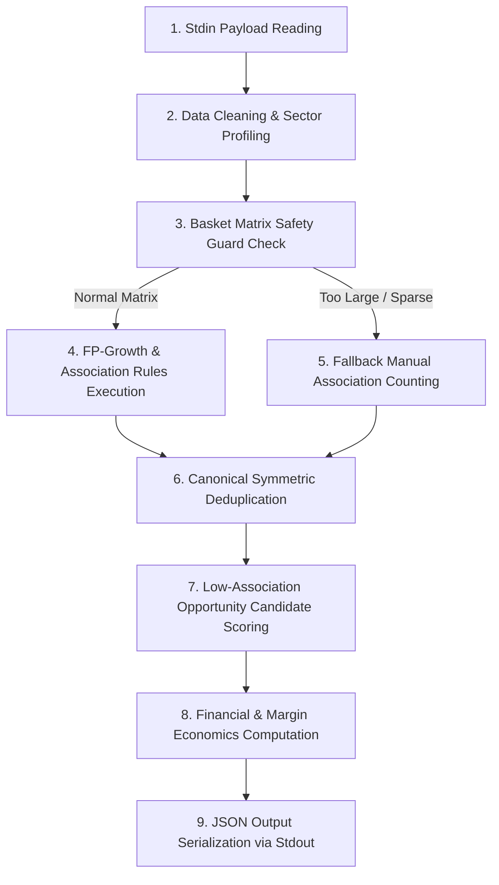

# 🛒 Cross-Selling Engine (`cross_sell.py`) Technical Breakdown
> **Comprehensive Guide: Mathematical Formulas, Module Imports, and Execution Logic**  
> *Target System:* WOOF Capstone DEV (NestJS Backend + Python ML Interop)

---

## 🧮 1. Mathematical & Logical Formulas

### A. Association Mining Metrics (FP-Growth)

For any product association rule `Item A -> Item B` (where Item A is the antecedent/anchor and Item B is the consequent/offer):

#### 1. Support (Co-occurrence Frequency)
Measures the proportion of total multi-item customer baskets containing both Item A and Item B:

`Support(Item A and Item B) = (Baskets containing both Item A and Item B) / (Total Multi-Item Baskets)`

#### 2. Confidence (Conditional Probability)
Measures the conditional probability that a customer purchases Item B given that they have placed Item A in their basket:

`Confidence(Item A -> Item B) = P(Item B | Item A) = Support(Item A and Item B) / Support(Item A)`

#### 3. Lift Multiplier (Statistical Independence Ratio)
Measures how much more frequently Item A and Item B are bought together than would be expected if their purchases were statistically independent:

`Lift(Item A -> Item B) = Support(Item A and Item B) / (Support(Item A) * Support(Item B))`  
OR  
`Lift(Item A -> Item B) = Confidence(Item A -> Item B) / Support(Item B)`

* **Lift > 1.0**: Positive co-purchasing correlation (synergy / items boost each other's sales).
* **Lift = 1.0**: Independent items (no behavioral affinity).
* **Lift < 1.0**: Negative correlation (substitutes).

---

### B. Un-Promoted Opportunity Scoring Formula

To identify **Emerging Trends / Bundle Candidates** (items that are **not yet strongly associated** in history but have high commercial upside):

#### 1. Lift Gap
`Lift Gap = max(0, MinLift - Lift) / MinLift`

#### 2. Confidence Gap
`Confidence Gap = max(0, MinConfidence - Confidence) / MinConfidence`

#### 3. Opportunity Score
`Opportunity Score = Support(Anchor) * (1 - Support(Bundle)) * (0.6 * Lift Gap + 0.4 * Confidence Gap)`

* **Support(Anchor)**: High customer foot traffic on the anchor item.
* **1 - Support(Bundle)**: High uncaptured market upside for the secondary item.
* **Gap Weighting**: Prioritizes pairs where marketing intervention (bundling) can bridge unexploited demand.

---

### C. Financial & Margin-Aware Bundle Pricing Formulas

#### 1. Combined Regular Price
`Regular Price = Item A Price + Item B Price`

#### 2. Combined Regular Cost Basis
`Regular Cost = Item A Cost + Item B Cost`

#### 3. Maximum Safe Discount Ceiling
Calculates the absolute highest percentage discount allowed before profit margin drops below the target minimum threshold (Minimum Margin = 30% or 0.30):

`Max Safe Discount % = ((Regular Price - (Regular Cost / (1 - MinMargin))) / Regular Price) * 100`

#### 4. Promotional Bundle Price
`Bundle Price = Regular Price * (1 - (Selected Discount % / 100))`

#### 5. Customer Savings (PHP)
`Savings = Regular Price - Bundle Price`

#### 6. Projected Gross Profit
`Projected Gross Profit = Bundle Price - Regular Cost`

#### 7. Projected Gross Profit Margin %
`Projected Margin % = (Projected Gross Profit / Bundle Price) * 100`

---

### D. Canonical Symmetric Deduplication Logic

Standard association rule algorithms output both directions: `Item A -> Item B` and `Item B -> Item A`. To prevent UI clutter, the script sorts item names alphabetically into a unique key tuple:

`pair_key = tuple(sorted([Item A, Item B]))`

It retains **only the single direction** with the higher confidence score.

---

## 📦 2. Imports & Module Roles

| Library / Module | Exact Role in Script |
| :--- | :--- |
| **`sys`** | Reads input JSON payloads from NestJS via standard input (`sys.stdin`) and returns final JSON results via standard output (`sys.stdout`). Also handles error logging to `sys.stderr`. |
| **`json`** | Deserializes incoming transaction arrays/config options and serializes outgoing ML results back to NestJS. |
| **`warnings`** | Suppresses non-critical Python library deprecation or runtime warnings (`warnings.filterwarnings('ignore')`). |
| **`math`** | Provides mathematical utility functions (`math.isnan`, `math.isinf`) to clean and sanitize NaN/Infinite values before JSON output. |
| **`collections.defaultdict`** | High-performance dictionary structure used for tracking item co-occurrence counts, sector profiles, and basket stats without key errors. |
| **`pandas (pd)`** | Builds 1-hot encoded Boolean DataFrames (`DataFrame(te_ary, columns=te.columns_)`) required as input by `mlxtend`'s FP-Growth function. |
| **`mlxtend.frequent_patterns.fpgrowth`** | Core Machine Learning function. Constructs frequent pattern trees (FP-Trees) from customer transaction matrices up to **100x faster** than Apriori. |
| **`mlxtend.frequent_patterns.association_rules`** | Evaluates frequent itemsets generated by FP-Growth to calculate Support, Confidence, and Lift for all candidate rules. |
| **`mlxtend.preprocessing.TransactionEncoder`** | Transforms raw lists of basket item names (e.g. `[['Latte', 'Muffin'], ['Grooming']]`) into a 1-hot boolean sparse matrix (`True`/`False`). |

---

## 🔄 3. Execution Logic & Step-by-Step Workflow

### Step 1: Payload Parsing & Threshold Defaults
* Reads the incoming JSON payload from NestJS containing multi-item baskets, user threshold settings (`minSupport`, `minConfidence`, `minLift`), `itemPrices`, and `itemEconomics`.

### Step 2: Data Cleaning & Product Sector Profiling
* Filters out empty/null item names.
* Builds sector profiles for each product (mapping items to **Cafe**, **Retail**, or **Services**) and weighs sector affinity.

### Step 3: Matrix Safety Guard Evaluation
* Checks the matrix size: `Total Baskets * Unique Items`.
* If total matrix cells exceed `25,000,000` or memory guards trigger, the script bypasses dense matrix encoding and switches to a memory-safe fallback counting loop to prevent server crashes.

### Step 4: FP-Growth & Association Mining (`mlxtend`)
1. Converts transaction lists into a boolean matrix using `TransactionEncoder`.
2. Runs `fpgrowth(df, min_support=min_support, use_colnames=True)` to extract frequent itemsets.
3. Calls `association_rules(frequent_itemsets, metric="confidence", min_threshold=min_confidence)` to calculate Support, Confidence, and Lift.

### Step 5: Rule Filtering & Deduplication
* Filters rules meeting `minLift` thresholds.
* Deduplicates symmetric pairs (`Item A -> Item B` vs `Item B -> Item A`) using alphabetical sorting, retaining the direction with higher confidence.

### Step 6: Opportunity Candidate Scoring (Un-Promoted Bundles)
* Pairs Fast-Moving Anchors (top 25% support) with Slow-Moving Offers (bottom 50% support) that do **not** already have strong historical co-occurrence.
* Ranks them using the **Opportunity Score formula** to discover high-upside bundling strategies.

### Step 7: Economic & Margin Computation
* For every rule and bundle candidate, attaches real-time pricing data: regular price, cost basis, suggested discount, safe discount ceiling, projected profit, and projected margin.

### Step 8: JSON Output Serialization
* Sanitizes any NaN or infinite values and outputs the final structured JSON object back to the NestJS backend via `sys.stdout`.
