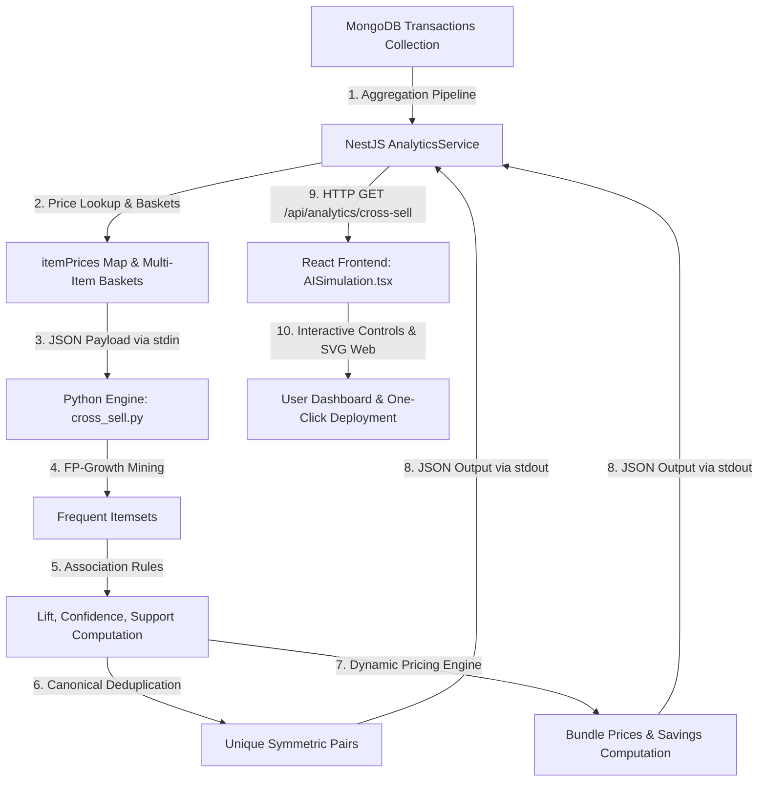

# 🛒 WOOF AI Bundle Simulator & Cross-Selling Analytics Engine
> **Complete Technical, Algorithmic, and Operational Documentation**  
> *Target System:* WOOF Capstone DEV (NestJS Backend + Python ML Interop + React/Next.js Frontend)

---

## 📌 1. Business Objective & Executive Summary

The **AI Simulation Laboratory (Bundle Simulator)** is an intelligence engine designed to discover customer buying patterns, uncover cross-sector synergies (Cafe, Pet Retail, Pet Grooming/Services), and boost **Average Order Value (AOV)**.

### Core Goals:
1. **Automated Cross-Selling**: Extract statistically proven product combinations from real customer transactions using machine learning.
2. **Inventory Velocity Optimization**: Pair fast-selling anchor products (e.g., *Iced Latte*, *Dog Food*) with slower-moving high-margin offers (e.g., *Pet Cologne*, *Nail Trim*) to accelerate inventory turnover.
3. **Dynamic Bundle Pricing**: Automatically calculate item-level market rates, regular combined totals, a **15% discounted bundle price**, and total customer savings in ₱ (PHP).
4. **Cross-Sector Synergies**: Bridge transactions across different sectors (e.g., a customer bringing their pet for grooming also purchasing coffee at the cafe).

---

## 🏗️ 2. End-to-End System Architecture



---

## ⚙️ 3. Detailed Data Pipeline Breakdown

### Step 1: MongoDB Aggregation (`analytics.service.ts`)
When the frontend requests `/api/analytics/cross-sell`, NestJS executes 4 parallel MongoDB aggregations:
1. **Multi-Item Baskets Aggregation**: Groups line items by `transactionId`. Filters out single-item baskets (`{ $match: { 'items.1': { $exists: true } } }`).
2. **Item Pricing Aggregation**: Calculates average unit price per product across all transactions:
   ```typescript
   this.transactionModel.aggregate([
     { $group: { _id: '$productName', avgPrice: { $avg: '$unitPrice' } } }
   ])
   ```
3. **Hourly Volume Aggregation**: Computes transaction counts per hour ($7\text{ AM} - 7\text{ PM}$) in `Asia/Manila` timezone.
4. **Sector Summary**: Aggregates line items and transaction counts for Cafe, Services, and Retail.

### Step 2: Python Interop (`cross_sell.py`)
NestJS passes the baskets, user thresholds, and `itemPrices` map to `cross_sell.py` via Python child process standard I/O (`stdin` / `stdout`).

---

## 🧠 4. Machine Learning & Algorithmic Foundations

### 4.1. FP-Growth (Frequent Pattern Growth) vs. Apriori
The engine uses **FP-Growth** (`mlxtend.frequent_patterns.fpgrowth`), which is up to **100x faster than Apriori**:
* **No Candidate Generation**: Instead of repeatedly scanning the database to generate candidate pairs (like Apriori), FP-Growth builds a compressed **FP-Tree** (Frequent Pattern Tree) in memory.
* **Divide-and-Conquer**: Recursively mines frequent pattern paths directly from the FP-Tree.

---

### 4.2. Mathematical Formulas for Association Mining

For any association rule $A \rightarrow B$ (e.g., $\text{Iced Cappuccino} \rightarrow \text{Dog Treats}$):

#### 1. Support (Frequency of Co-occurrence)
Measures how frequently the combination appears in all multi-item transactions.
$$\text{Support}(A \rightarrow B) = P(A \cap B) = \frac{\text{Number of baskets containing both } A \text{ and } B}{\text{Total Multi-Item Baskets}}$$

#### 2. Confidence (Conditional Probability)
Measures the likelihood that a customer buys item $B$ given that they bought item $A$.
$$\text{Confidence}(A \rightarrow B) = P(B | A) = \frac{\text{Support}(A \cap B)}{\text{Support}(A)} = \frac{\text{Baskets containing } A \text{ and } B}{\text{Baskets containing } A}$$

#### 3. Lift Multiplier (Strength of Association)
Measures how much more often $A$ and $B$ are bought together than would be expected if they were statistically independent.
$$\text{Lift}(A \rightarrow B) = \frac{\text{Support}(A \cap B)}{\text{Support}(A) \times \text{Support}(B)} = \frac{\text{Confidence}(A \rightarrow B)}{\text{Support}(B)}$$

* **$\text{Lift} > 1.0$**: Positive correlation. Items boost each other's sales.
* **$\text{Lift} = 1.0$**: Independent items. No relationship.
* **$\text{Lift} < 1.0$**: Negative correlation (substitutes).

---

### 4.3. Product Velocity Classification & Low-Association Bundling

Every product is classified into a **Velocity Tier** based on its overall support percentile:
* **Fast-Moving Anchor**: Top 25% percentile support (e.g., *Espresso*, *Basic Grooming*).
* **Moderate-Moving**: 25% to 50% percentile support.
* **Slow-Moving Offer**: Bottom 50% percentile support (e.g., *Specialty Pet Shampoo*, *Pastry*).

#### Low-Association Opportunity Scoring:
To find hidden revenue potential where items are **not yet strongly associated**, the algorithm pairs Fast-Moving Anchors with Slow-Moving Offers and scores them:
$$\text{Opportunity Score} = \text{Support}_{\text{Anchor}} \times (1 - \text{Support}_{\text{Bundle}}) \times (0.6 \times \text{LiftGap} + 0.4 \times \text{ConfidenceGap})$$

---

### 4.4. Canonical Symmetric Rule Deduplication

In standard association rule output, the algorithm yields both $A \rightarrow B$ and $B \rightarrow A$ (e.g., $\text{Coffee} \rightarrow \text{Muffin}$ and $\text{Muffin} \rightarrow \text{Coffee}$). Showing both clutters the UI.

**Solution in `cross_sell.py`**:
```python
# Create a canonical tuple key sorted alphabetically
pair_key = tuple(sorted([item_a, item_b]))

# Retain only the direction with higher confidence score
if pair_key not in deduped_rules or rule_obj["confidence"] > deduped_rules[pair_key]["confidence"]:
    deduped_rules[pair_key] = rule_obj
```
This guarantees that each unique product pair appears exactly **once** in the UI node graph and bundle lists.

---

## 💰 5. Dynamic Pricing & Savings Engine

To provide actionable business utility, `cross_sell.py` enriches every rule and bundle candidate with live financial metrics:

| Field | Formula / Source | Description |
| :--- | :--- | :--- |
| `itemAPrice` | `itemPrices.get(itemA)` | Real-time average unit price of Product A from MongoDB. |
| `itemBPrice` | `itemPrices.get(itemB)` | Real-time average unit price of Product B from MongoDB. |
| `regularPrice` | $Price_A + Price_B$ | Combined un-discounted price for both items. |
| `bundlePrice` | $RegularPrice \times 0.85$ | Promotional bundle price reflecting a **15% discount**. |
| `savings` | $RegularPrice - BundlePrice$ | Exact customer savings amount in ₱ (PHP). |

---

## 🎨 6. Frontend Dashboard Architecture (`AISimulation.tsx`)

The frontend UI is built using React, Lucide Icons, Recharts, Radix UI Tooltips, and Tailwind CSS.

### Key Sections:

#### 1. KPI Metric Row
* **Discovered Patterns**: Count of active FP-Growth rules. Includes business tooltip explaining statistical validation.
* **Bundle Candidates**: High-opportunity fast + slow item combinations.
* **Avg Lift Multiplier**: Overall co-purchase likelihood multiplier across rules.
* **Avg Confidence**: Mean conditional probability percentage.

#### 2. Raw Transaction Data & Hourly Slider
* **Hourly Volume Chart**: Bar chart illustrating sales volume per hour ($7\text{ AM} - 7\text{ PM}$).
* **Top Product Co-Purchases**: Dynamic progress bars showing top co-occurrences for the selected time window.
* **Time Selector Slider**: Allows managers to filter transaction patterns by specific operating hours.

#### 3. Live Behavioral Web (FP-Growth Interactive Node Graph)
* **SVG Network Canvas**: Renders product nodes and rule connections in 2D space.
* **Node Styling**:
  * Node radius scales with purchase frequency ($32\text{px} - 56\text{px}$).
  * Colors represent business sectors:
    * 🟤 **Cafe**: `#D2B48C` (Tan)
    * 🟢 **Services**: `#0D9488` (Teal)
    * 🟡 **Retail**: `#F59E0B` (Amber)
  * **SVG Text Wrapping**: Custom line-splitting algorithm wraps long product names into 1–3 SVG `<tspan>` lines automatically.
* **Connection Line Styling**:
  * Line thickness scales with confidence ($2\text{px} - 12\text{px}$).
  * High-confidence rules ($\ge 85\%$) feature an active SVG glow filter.
* **Interactive AI Sliders**:
  * **Support Threshold Slider ($0\% - 100\%$)**: Filters out rare/infrequent item combinations.
  * **Confidence Level Slider ($0\% - 100\%$)**: Sets minimum co-purchase probability threshold.

#### 4. AI-Predicted Bundle Opportunity Cards
Each card renders:
* **Bundle Name**: e.g., *Iced Latte + Dog Grooming Package*
* **Metrics**: Confidence %, Lift Multiplier, Co-occurrence frequency.
* **Pricing Tag**:
  $$\text{₱ItemA} + \text{₱ItemB} \longrightarrow \text{Original: }\cancel{\text{₱Regular}} \quad \mathbf{\text{₱BundlePrice}} \quad \text{\color{green}[Save ₱Savings (15% OFF)]}$$
* **Deploy Action**: Clicking **Deploy Bundle** fires a toast notification confirming activation and pricing setup.

---

## 📡 7. API Reference

### `GET /api/analytics/cross-sell`

#### Query Parameters:
| Parameter | Type | Default | Description |
| :--- | :--- | :--- | :--- |
| `minSupport` | `float` | `0.05` | Minimum support ratio ($5\%$). |
| `minConfidence` | `float` | `0.60` | Minimum confidence ratio ($60\%$). |
| `minLift` | `float` | `1.20` | Minimum lift ratio ($1.20x$). |
| `maxBundleCandidates`| `int` | `20` | Maximum low-association bundle candidates returned. |
| `hour` | `int` | `13` | Filter transactions by specific hour ($7 - 19$). |
| `sector` | `string` | `all` | Filter by sector (`cafe`, `retail`, `services`, or `all`). |

#### Sample JSON Response Output:
```json
{
  "rules": [
    {
      "itemA": "Iced Cappuccino",
      "itemB": "Dog Biscuit Bag",
      "antecedents": ["Iced Cappuccino"],
      "consequents": ["Dog Biscuit Bag"],
      "antecedentSectors": ["cafe"],
      "consequentSectors": ["retail"],
      "support": 0.125,
      "confidence": 0.784,
      "lift": 2.45,
      "cooccurrences": 34,
      "isMultiItem": false,
      "crossSector": true,
      "itemAPrice": 140.00,
      "itemBPrice": 120.00,
      "regularPrice": 260.00,
      "bundlePrice": 221.00,
      "savings": 39.00
    }
  ],
  "bundleCandidates": [
    {
      "anchorItem": "Iced Latte",
      "bundleItem": "Pet Cologne Spray",
      "itemA": "Iced Latte",
      "itemB": "Pet Cologne Spray",
      "anchorVelocity": "fast",
      "bundleVelocity": "slow",
      "confidence": 0.42,
      "lift": 1.15,
      "regularPrice": 330.00,
      "bundlePrice": 280.50,
      "savings": 49.50,
      "reason": "Fast-moving item paired with a slower-moving item that is not already strongly associated."
    }
  ],
  "totalBaskets": 272,
  "multiItemBaskets": 185
}
```

---

## 🛠️ 8. Maintenance & Troubleshooting Guide

1. **Python Dependencies**:
   Ensure `mlxtend` and `pandas` are installed in the backend Python runtime:
   ```bash
   pip install mlxtend pandas
   ```
2. **"No Frequent Itemsets Found" Warning**:
   If customer transactions in the system are low or sparse, lower the **Support Threshold** to $1\% - 5\%$ or the **Confidence Level** to $30\% - 50\%$ using the interactive sliders on the dashboard.
3. **Price Calculation Fallback**:
   If an item has `unitPrice = null` or 0 in MongoDB transactions, `itemAPrice` defaults gracefully to `0.00`, and the UI displays standard bundle promotional text without crashing.

---
*Document Version: 1.0 (WOOF Capstone Dev)*
