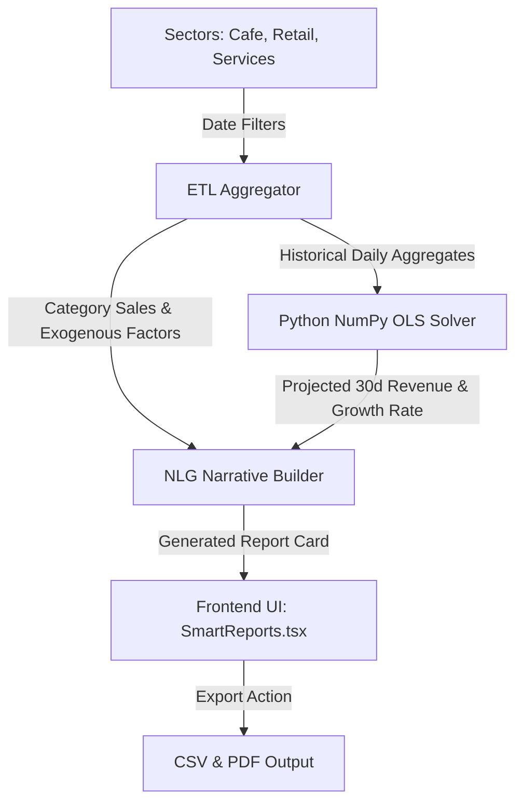

# WOOF System Documentation: Smart Reports Module
## Capstone Defense Reference Manual

---

## 1. Feature Overview & Architecture

### Proactive Strategic Asset vs. Passive Tracking
Traditional point-of-sale (POS) and analytics platforms act as passive ledger tools—documenting historical sales after they happen. The **Smart Reports** module of the **WOOF** system represents a transition from descriptive analytics to prescriptive decision support. 

Rather than simply compiling logs, the module combines:
* **Historical Aggregation (ETL)**
* **Exogenous-Aware Predictive Analytics (OLS Trend Extrapolation)**
* **Automated Natural Language Generation (NLG)**

This integration allows business owners to identify operational trajectories, predict future volume constraints, analyze customer feedback trends, and act on context-specific strategic advice.

### Placement & Target User
The target user is the business owner of **Happy Tails Lucena City** (Cafe, Retail, & Pet Services). The Smart Reports interface provides a unified view of performance metrics across three distinct business sectors, translating complex SQL aggregates and NumPy forecasting arrays into plain English and Taglish feedback insights.



---

## 2. Report Parameters (Inputs)

Generating a Smart Report requires four key configuration parameters:

| Input Parameter | Data Type | UI Element | Operational Purpose |
| :--- | :--- | :--- | :--- |
| **Report Title** | `String` | Text Input | Used for report identification and naming conventions in exports/PDFs. |
| **Start Date** | `Date (YYYY-MM-DD)` | Date Picker | Sets the initial boundary for historical transaction retrieval. |
| **End Date** | `Date (YYYY-MM-DD)` | Date Picker | Sets the final boundary for historical transaction retrieval. |
| **Target Sectors** | `Array<String>` | Checkbox Group | Filters transactions by sector (`Cafe`, `Retail`, `Services`). Supports multi-select. |

---

## 3. Core Analytics & Outputs (Under the Hood)

### KPI Generation
The system processes raw sales data retrieved from the Supabase transactional tables to calculate five critical metrics:
1. **Total Revenue**: $\sum (\text{Unit Price} \times \text{Quantity} - \text{Discounts})$ across the selected date range and sectors.
2. **Gross Profit**: $\sum (\text{Revenue} - \text{Unit Cost} \times \text{Quantity})$.
3. **Average Profit Margin**: $\left(\frac{\text{Gross Profit}}{\text{Total Revenue}}\right) \times 100$, indicating capital efficiency.
4. **Data Completeness**: Evaluates transactional data health by validating fields such as unit costs, category tags, and payment channels. It calculates the percentage of clean, non-null, and fully attributed records relative to the total rows fetched.

### Trend Extrapolation (NumPy OLS Model)
The forecasting engine calculates a 30-day projection using an Ordinary Least Squares (OLS) multivariate regression model. The engine is located in `backend/src/smart-reports/python/extrapolate_trends.py`.
* **Feature Vector**: It maps historical daily revenue against time steps $t$ along with exogenous variables such as average daily temperature, rainfall (mm), and local holiday status (1/0).
* **Mathematics**: The model solves the matrix equation:
  $$y = X\beta + \epsilon$$
  where $y$ represents daily revenue, $X$ is the matrix of inputs (including temperature, rain, holidays, and trend step), and $\beta$ is the solved coefficient vector.
* **Outputs**: Generates a 30-day projection of daily values, calculates the projected period growth rate, and labels the general trend direction (`UPWARD`, `DOWNWARD`, or `STABLE`).

### Natural Language Generation (NLG)
The NLG engine translates numerical metrics into human-readable prose. It dynamically constructs a multi-paragraph executive brief containing:
* **Performance Summary**: Explains total net revenue, gross profit, and performance share of the top-performing sales channels and categories.
* **Forecast Interpretation**: Clearly translates the regression slope (e.g., *"...indicates an upward trend for the upcoming 30 days. Daily revenue is projected to move with a calculated period growth rate..."*).
* **Strategic Advisories**: Evaluates the output direction of the OLS model and outputs actionable recommendations.

### Customer Sentiment Analysis (Taglish Keyword Indexing)
To process regional customer feedback, the sentiment engine utilizes a localized Taglish keyword lexicon. It parses comments containing mixed English and Tagalog terms:
* **Positive Triggers**: `"mabait"`, `"masarap"`, `"ganda"`, `"friendly"`, `"sulit"`, `"love"`.
* **Negative Triggers**: `"matagal"`, `"mahal"`, `"masungit"`, `"malata"`, `"marumi"`, `"refund"`.
* **Score Mapping**: Assigns numerical polarity values to generate an aggregate sentiment score and classifying the feedback as `POSITIVE`, `NEUTRAL`, or `NEGATIVE`.

### Strategic Advisory Rules
Advisories are determined based on the predicted trend:
* **UPWARD Trend**: Recommends scaling up inventory levels for the leading product categories and increasing marketing budgets for the top sales channel.
* **DOWNWARD Trend**: Recommends operational cost audits, review of pricing structures, and launching loyalty boosters to stabilize margins.
* **STABLE Trend**: Recommends optimizing Average Order Value (AOV) via product bundling, cross-selling, and feedback loop audits.

---

## 4. Validation Modals & Edge Cases

To prevent data corruption, empty charts, and misinterpretations, three validation steps are integrated:

```
[User Clicks "Generate Report"]
          │
          ├──> [Check 1: Is Start Date > End Date?] ──Yes──> Show Modal 3 (Invalid Date)
          │
          ├──> [Check 2: Does API return empty/404?] ──Yes──> Show Modal 2 (No Data Found)
          │
          └──> [Check 3: Is channel count == 1 && POS?] ──Yes──> Show Modal 1 (Data Notice)
```

### Modal 1: Data Integration Notice
* **Trigger Condition**: Successfully generated report contains revenue data, but the active channels are limited to `POS` (meaning external platforms Shopee, TikTok Shop, and PetHub have 0 active sales).
* **User Impact**: Alerts the business owner that the report lacks multi-channel integrations, preventing them from interpreting the lack of external sales as a business decline.

### Modal 2: No Data Found
* **Trigger Condition**: API returns a `404 Not Found` or an error message matching `"No transactions found"` for the selected filters.
* **User Impact**: Informs the user that no sales records exist in the database for the given date range and sectors, preventing blank charts or rendering errors.

### Modal 3: Invalid Date Selection
* **Trigger Condition**: Frontend validates that `Start Date` is chronologically after `End Date`.
* **User Impact**: Blocks the request immediately, displaying an explanation modal that prevents useless backend requests.

---

## 5. Export Functionality

### CSV Export
* **Format**: Comma-Separated Values (formatted with UTF-8 BOM to ensure compatibility with Microsoft Excel).
* **Contents**:
  * Report metadata (Title, Range, Sectors).
  * Key performance metrics (Revenue, Profit, Margin, Completeness).
  * Category sales breakdowns and Channel contributions.
  * Extrapolated 30-day forecast table (Dates and Projected Daily Revenues).

### PDF / Print Export
* **Format**: Standard ISO Document Layout via native print driver printing.
* **Implementation**: Uses CSS `@media print` directives in the web stylesheet to:
  * Hide sidebar navigation, main dashboard headers, filters, and action buttons.
  * Format the report card to span full-width.
  * Prevent page-breaks in the middle of key charts or narrative blocks.
  * Output a clean, executive document suitable for stakeholders.
